# TOXMAP Screen Catalog — Original UI Reference

**Date:** 2026-07-15  
**Purpose:** Visual reference for developers building the open-source ToxMap clone. All screenshots are NLM-published figures from peer-reviewed PMC articles.  
**Sources:**
- **2006 Article** (Roth SL, *Med Ref Serv Q* 2006): 12 figures of original TOXMAP (ArcIMS era)
- **2015 Article** (Roth SL & Kalis MA, *Med Ref Serv Q* 2014): 6 figures of redesigned TOXMAP (ArcGIS for Server/Flex era)

**Figure credits:** [docs/FIGURE_CREDITS.md](../FIGURE_CREDITS.md)  
**Related docs:** [Tech Stack Analysis](../adr/TOXMAP_TECH_STACK_ANALYSIS.md) · [ADR-001](../adr/ADR-001-fastapi-postgis-react.md) · [Usability Study](https://dpcpsi.nih.gov/sites/g/files/mnhszr346/files/FR508_10-4004_NLM_11-03-11.pdf)

---

## Part I: Original TOXMAP — ArcIMS Era (2004–2012)

### Fig 1-2006-A: The 2004 Original Interface
> *Source: 2015 article, Figure 1*

*[View figure on PMC](https://pmc.ncbi.nlm.nih.gov/articles/PMC4251466/figure/F1/)*

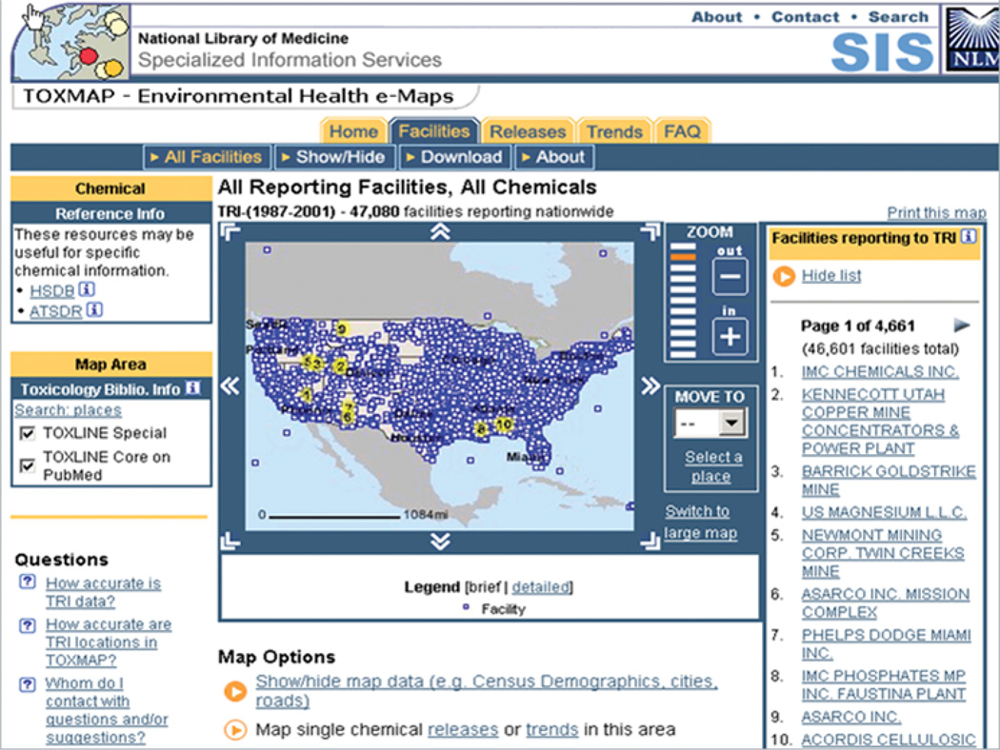

**Caption:** TOXMAP facilities map, 2004.

**What you're seeing:**
- The original ArcIMS-based interface with a **fixed, non-seamless map** (pan by clicking arrows, not drag)
- Map fills the browser with facility dots plotted on a static USGS National Atlas basemap
- Toolbar across the top with text-labeled navigation and feature buttons
- No side panels — controls appeared as floating popup windows
- Color-coded TRI release dots visible across the contiguous US
- Thin basemap styling with state/county boundaries visible

**Design implications for clone:**
- ✅ Adopt: Color-coded facility dots by release amount (carried forward to redesign)
- ✅ Adopt: Contiguous US overview as default starting view
- ❌ Don't replicate: Fixed/static map — replace with MapLibre GL seamless pan/zoom
- ❌ Don't replicate: Floating popup windows — UCD 2011 confirmed these caused confusion
- ❌ Don't replicate: Text-menu-only toolbar — replace with labeled icon toolbar (UCD 2011)

---

### Fig 1: TRI Chemical Search — Dioxane Nationwide
> *Source: 2006 article, Figure 1*

*[View figure on PMC](https://pmc.ncbi.nlm.nih.gov/articles/PMC2703818/figure/F1/)*

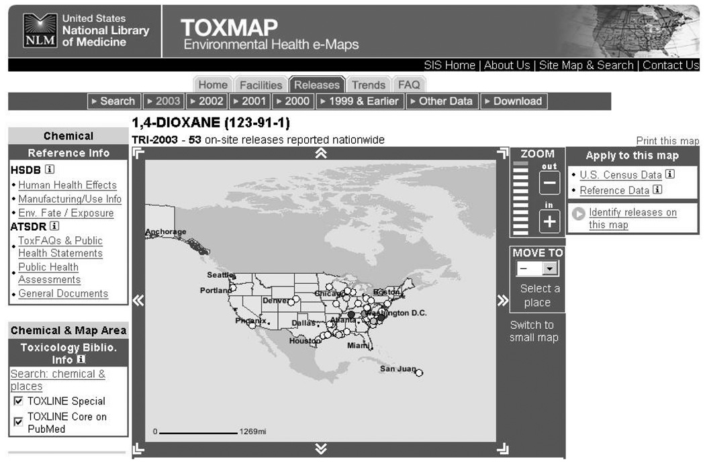

**Caption:** TRI Facilities Reporting Release of Dioxane in the United States, 2003.

**What you're seeing:**
- Result of entering "dioxane" in the Quick Search box
- All US facilities reporting dioxane releases plotted as **color-coded dots** (green/yellow/red by release amount)
- Map spans the full contiguous US
- A **legend** on the left side shows release amount ranges (color to quantity mapping)
- A results **table/list panel** is visible listing facilities
- The Quick Search input is visible at top-left

**Design implications for clone:**
- Color scale for release amounts: implement as MapLibre GL `paint` expression mapping `total_release_lbs` to a stepped color ramp (green → yellow → red)
- The legend must show quantity ranges inline (not mouse-over) — enforced by UCD 2011 finding F-14
- Quick Search input triggers GeoJSON re-fetch on submit and on map zoom/pan

---

### Fig 2: Facility Detail — Dioxane Release Record
> *Source: 2006 article, Figure 2*

*[View figure on PMC](https://pmc.ncbi.nlm.nih.gov/articles/PMC2703818/figure/F2/)*

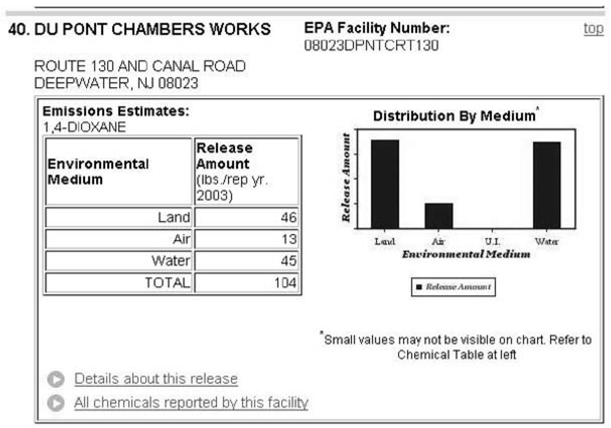

**Caption:** Dioxane Release Information for TRI Facility.

**What you're seeing:**
- A **facility detail popup/panel** showing:
  - Facility name, address, TRI Facility ID
  - **Yearly release amounts per medium**: air, water, land, underground injection in a table
  - Multiple years of history (annual rows)
  - **Links to more chemical information**: HSDB, ToxFAQs, etc.
  - All chemicals reported by this facility (not just dioxane)
- The map is still visible behind the popup

**Design implications for clone:**
- Facility detail drawer must show releases broken down by **4 mediums** (air, water, land, underground injection) — these are separate DB columns (see ADR-001 data model)
- Must show multiple years in a table (power users) AND a trend chart (visual users)
- "All chemicals at this facility" section is required — not just the searched chemical
- External links to HSDB/ToxFAQs should open in a new tab without losing map state (UCD 2011 Task 8)

---

### Fig 3: 15-Year Release Trend Map
> *Source: 2006 article, Figure 3*

*[View figure on PMC](https://pmc.ncbi.nlm.nih.gov/articles/PMC2703818/figure/F3/)*

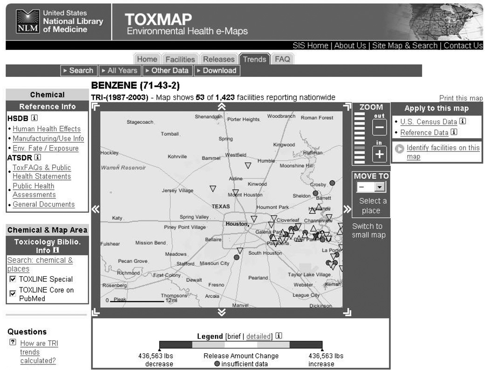

**Caption:** TRI Facility Benzene Release Trends, Houston, TX Area.

**What you're seeing:**
- A **choropleth-style trend visualization** — map dots change size/color to represent benzene release trends over 15 years
- The Houston metro area is zoomed in
- Each facility dot represents a trend summary, not just a single year
- A sidebar panel shows the trend data numerically per facility

**Design implications for clone:**
- The "Trends" view is a distinct **map mode** (not just the detail panel)
- In the clone, implement as a Recharts **horizontal bar chart** per facility in the sidebar, with years 2009–2024 on the x-axis
- Consider a map mode toggle: "Current Year" vs. "Trends" view
- The 15-year window is hard-coded per the original — use `from_year=current_year-14&to_year=current_year`

---

### Fig 4: TOXLINE Chemical+Region Literature Search
> *Source: 2006 article, Figure 4*

*[View figure on PMC](https://pmc.ncbi.nlm.nih.gov/articles/PMC2703818/figure/F4/)*

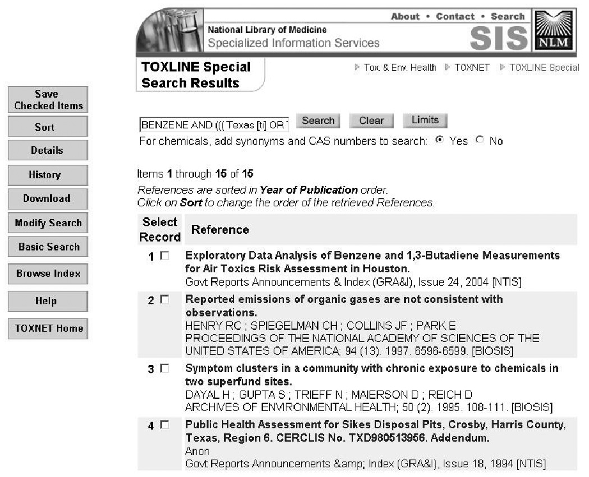

**Caption:** TOXLINE Search Results, Benzene/Houston Area.

**What you're seeing:**
- A **TOXLINE bibliographic search** launched from TOXMAP
- The query was automatically constructed from the selected chemical (benzene) AND the visible map region (Houston) — geographic text terms extracted from the map view
- Results show academic citations/references about benzene in the Houston area
- This is an **external search integration** — TOXMAP passes parameters to TOXLINE and opens results

**Design implications for clone:**
- This is an advanced feature (F-20) — "Chemical + Map Area" search
- Clone implementation: construct a PubMed/TOXLINE search URL from `chemical_name + state/county visible in viewport` and open in new tab
- URL pattern example: `https://pubmed.ncbi.nlm.nih.gov/?term=benzene+Houston+Texas`
- Does not require backend support — pure frontend URL construction

---

### Fig 5: City/Region Search — Los Angeles TRI Facilities
> *Source: 2006 article, Figure 5*

*[View figure on PMC](https://pmc.ncbi.nlm.nih.gov/articles/PMC2703818/figure/F5/)*

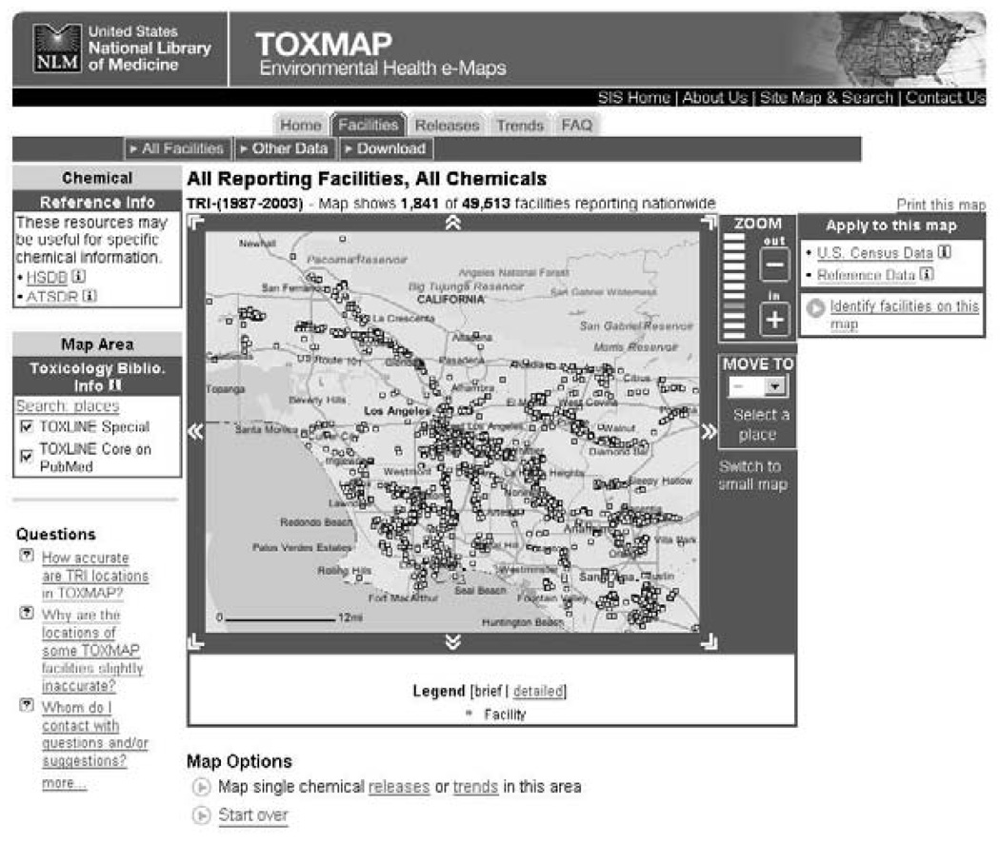

**Caption:** TRI Facilities in the Los Angeles Area, 2003.

**What you're seeing:**
- Result of entering "Los Angeles" in Quick Search (location-based, no chemical filter)
- Map zooms to the LA metro area and shows **all TRI facilities** as color-coded dots
- Both a **list panel** (left) and the **map** are visible — this is the dual-panel layout that UCD 2011 flagged as confusing
- Facility dots are clustered in industrial/port areas
- A USGS-style basemap with roads, city names

**Design implications for clone:**
- This confirms the "zoom to location" functionality is distinct from "filter to location"
- The list panel shows facilities sorted by release amount — this maps to our Results Table (F-09)
- The dual-panel layout visible here is **exactly what UCD 2011 told us to eliminate** — replace with single collapsible sidebar (F-08)
- Basemap: use OpenStreetMap/Protomaps tiles which include road names natively

---

### Fig 6: TRI Facility Record Popup
> *Source: 2006 article, Figure 6*

*[View figure on PMC](https://pmc.ncbi.nlm.nih.gov/articles/PMC2703818/figure/F6/)*

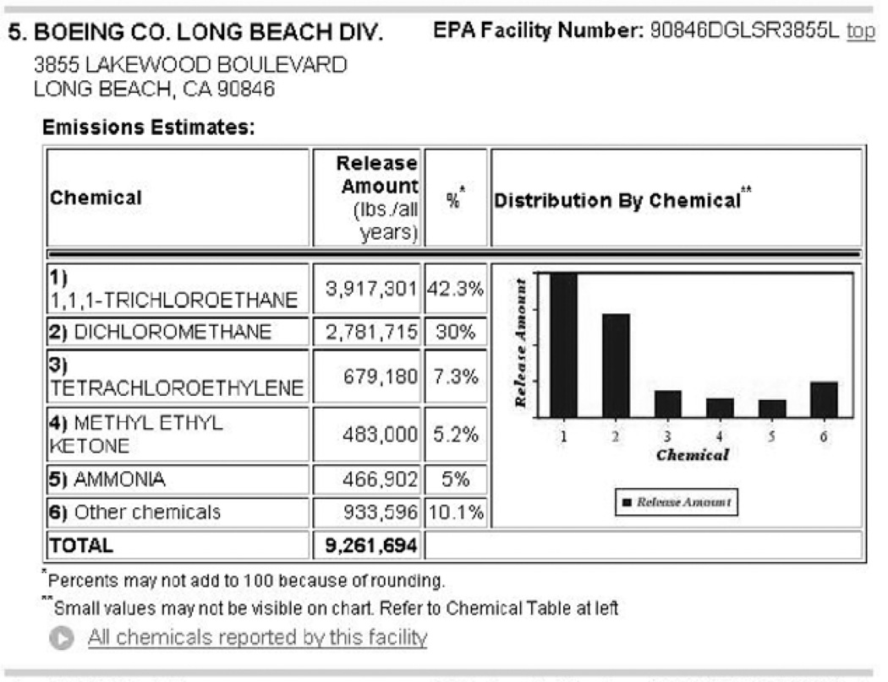

**Caption:** TRI Facility Record, Los Angeles Area, 2003.

**What you're seeing:**
- The **facility record popup** that appears when clicking a TRI dot
- Contains: facility name (bold, linked), address, TRI ID, state
- A **chemicals list** with release amounts per chemical for the year
- Links: "Release Details" (yearly breakdown by medium), "All Releases" (historical)
- External links to NLM/EPA resources for each chemical listed

**Design implications for clone:**
- Popup layout: name + address header, chemical summary table, action links
- The facility name should be a link to the full detail drawer/page
- UCD 2011 §"Closing Facility Pop-Ups" — add close link at bottom since corner X goes off-screen
- UCD 2011 §"Underlining Title" — don't underline the facility name unless it's actually a link
- The popup should NOT contain the full 15-year trend — that belongs in the detail drawer

---

### Fig 7: ATSDR ToxFAQ — External Chemical Resource
> *Source: 2006 article, Figure 7*

*[View figure on PMC](https://pmc.ncbi.nlm.nih.gov/articles/PMC2703818/figure/F7/)*

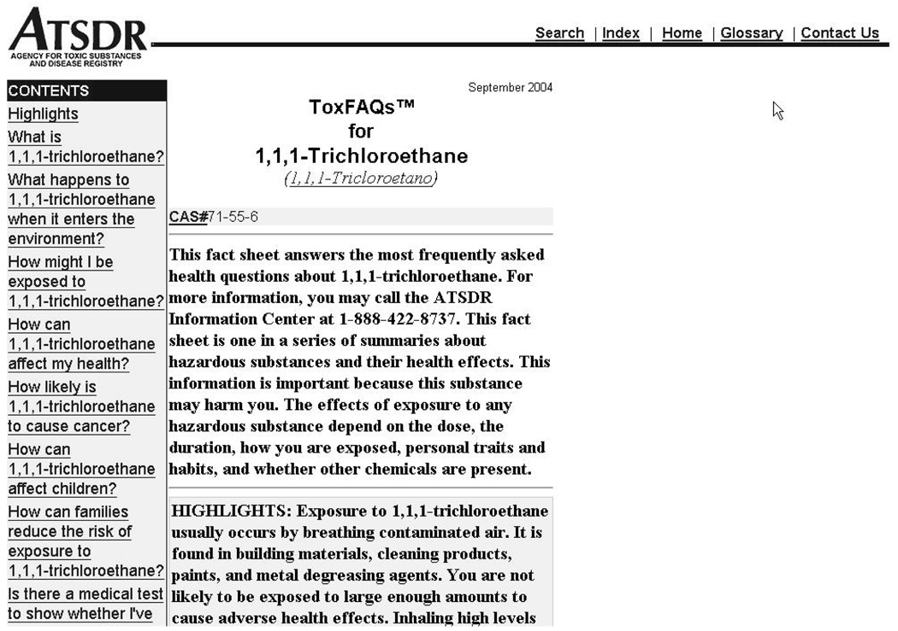

**Caption:** ATSDR ToxFAQ.

**What you're seeing:**
- The **ATSDR ToxFAQs page** for a chemical, opened from within TOXMAP
- Consumer-friendly format: "What is X?", "What happens when I am exposed to X?", "How can X affect my health?"
- This is an **external resource** — TOXMAP links to https://www.atsdr.cdc.gov/toxfaqs/

**Design implications for clone:**
- For every chemical, provide a direct link: `https://www.atsdr.cdc.gov/toxfaqs/tfacts{index}.pdf` or search URL
- Store the ATSDR ToxFAQ URL in the `chemicals` table as `atsdr_url` column
- Open in new tab — confirmed by UCD 2011 Task 8 (must not lose map state)

---

### Fig 8: NLM HSDB Chemical Record — Technical Resource
> *Source: 2006 article, Figure 8*

*[View figure on PMC](https://pmc.ncbi.nlm.nih.gov/articles/PMC2703818/figure/F8/)*

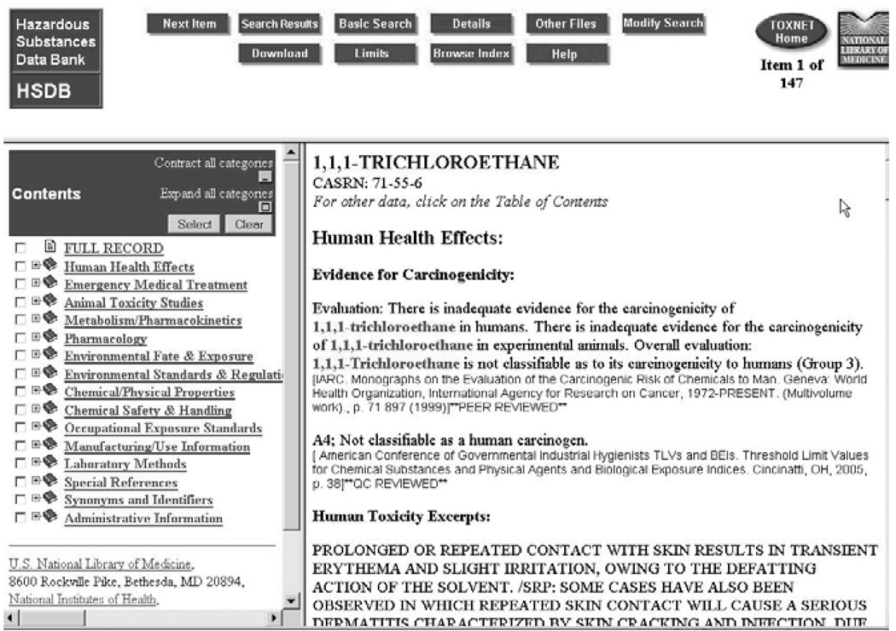

**Caption:** Chemical Record, NLM's Hazardous Substances Databank (HSDB).

**What you're seeing:**
- The **NLM HSDB record** for a chemical — highly technical, peer-reviewed toxicological data
- Sections: Emergency Medical Treatment, Pharmacology, Environmental Fate, Human Health Effects
- This is a second tier of chemical information — more technical than ToxFAQs
- HSDB is now part of NLM's PubChem

**Design implications for clone:**
- Provide two tiers of chemical links in the clone:
  1. "Plain language" → ATSDR ToxFAQ (for citizens)
  2. "Technical data" → PubChem (HSDB successor) at `https://pubchem.ncbi.nlm.nih.gov/compound/{name}`
- Store both URLs in `chemicals` table: `atsdr_url`, `pubchem_url` (or derive from CAS number)

---

### Fig 9: Superfund Site Map — Virginia
> *Source: 2006 article, Figure 9*

*[View figure on PMC](https://pmc.ncbi.nlm.nih.gov/articles/PMC2703818/figure/F9/)*

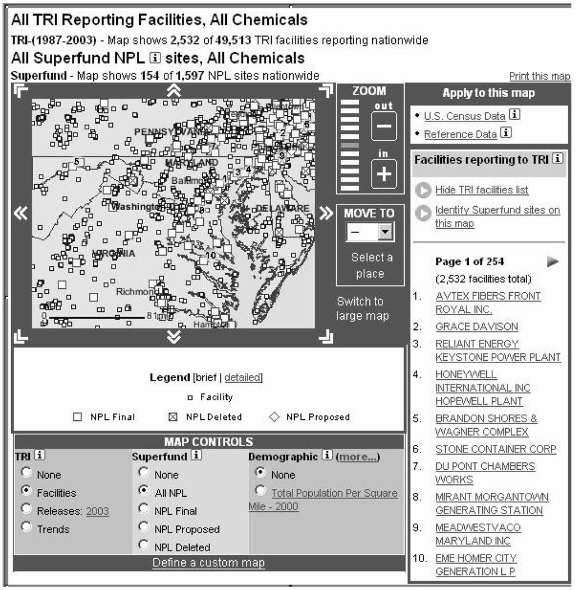

**Caption:** Superfund Site Map.

**What you're seeing:**
- A map of Virginia showing **Superfund/NPL sites** as distinct markers (different from TRI dots)
- The markers appear as **red diamonds** (different from TRI facility circles) — confirming the distinct icon requirement
- A list panel on the right shows the Superfund sites by name
- The state of Virginia is the geographic scope of the query

**Design implications for clone:**
- Superfund markers: use **diamond shape** (not circle) to visually distinguish from TRI circles — this is explicit in the original design
- Color: red diamonds with NPL status shown by fill vs. outline
- List panel shows site name + HRS score
- Confirming: state selection for Superfund must actually FILTER to that state (not just zoom) — this is even more critical for Superfund than TRI

---

### Fig 10: Superfund Site Record
> *Source: 2006 article, Figure 10*

*[View figure on PMC](https://pmc.ncbi.nlm.nih.gov/articles/PMC2703818/figure/F10/)*

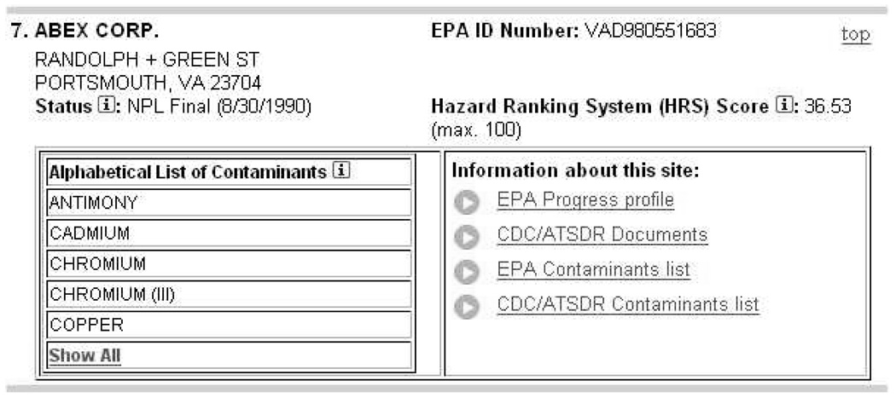

**Caption:** Superfund Site Record.

**What you're seeing:**
- The **Superfund site detail record** showing:
  - Site name, EPA ID, address
  - **HRS (Hazard Ranking System) score** — numerical score 0–100
  - **NPL status** and listing date
  - **Alphabetical contaminant list** — each chemical linked to NLM health info
  - Links: EPA Superfund Site Progress Profile, EPA contaminants list, CDC/ATSDR documents
  - This is a wide, horizontal layout (1050px × 467px — wider than tall)

**Design implications for clone:**
- Superfund detail panel layout: name/address header, HRS score badge, NPL date, then contaminant table
- Each contaminant in the list → same ATSDR/HSDB/PubChem links as TRI chemicals
- "EPA Site Progress Profile" → external link to `https://cumulis.epa.gov/supercpad/SiteProfiles/index.cfm?fuseaction=second.Cleanup&id={EPAIDS}`
- The HRS score should be visually prominent (badge/indicator) — it's the primary risk signal for Superfund sites

---

### Fig 11: Bar Charts — Three-Tab Release Visualization
> *Source: 2006 article, Figure 11*

*[View figure on PMC](https://pmc.ncbi.nlm.nih.gov/articles/PMC2703818/figure/F11/)*

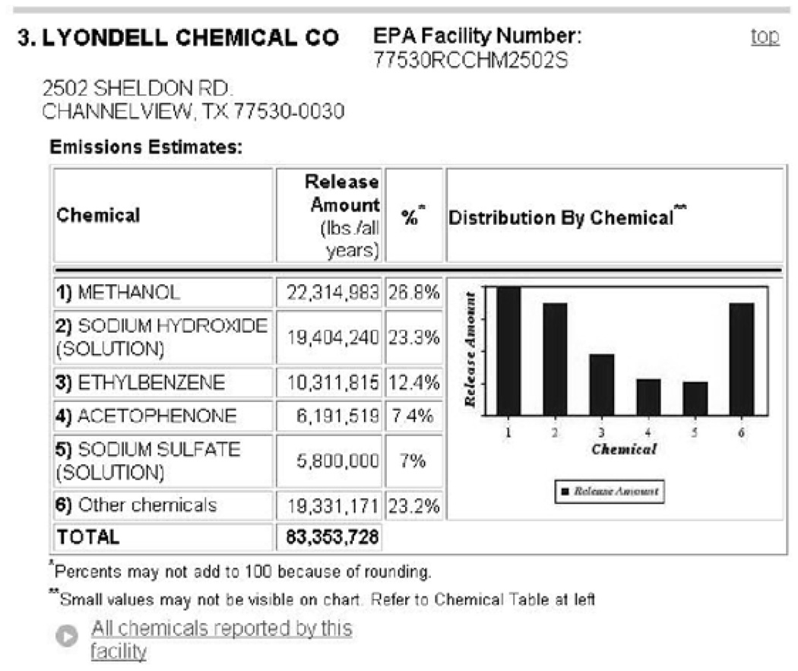

**Caption:** Release Distribution by Chemical for a Texas TRI Facility.

**What you're seeing:**
- A **three-tab bar chart panel**:
  - **"Facilities" tab**: Bar chart of up to 5 top chemicals released by the selected facility (sorted by release volume)
  - **"Releases" tab**: Bar chart of release distribution by medium (land, air, water, underground injection) per chemical
  - **"Trends" tab**: 15-year bar chart of annual emission estimates for the selected chemical
- All three tabs are visible in the panel header
- Chart is a standard horizontal or vertical bar chart — appears to be horizontal
- Background map still visible; chart appears as a floating panel or sidebar section

**Design implications for clone — this is the most detailed chart specification:**
- **Tab 1 (Facilities)**: `BarChart` with up to 5 chemicals on Y-axis, release lbs on X-axis — use `chemical_name` labels
- **Tab 2 (Releases)**: Stacked or grouped bar chart with 4 segments: `air_release_lbs`, `water_release_lbs`, `land_release_lbs`, `underground_release_lbs` — use a distinct color per medium
- **Tab 3 (Trends)**: Time series bar chart: years 2009–2024 on X-axis, `total_release_lbs` on Y-axis for the selected chemical at this facility
- All three tabs are part of the facility detail component, not separate pages
- Recharts `BarChart` + `Tooltip` + `Legend` handles all three

**Medium color scheme (suggested, based on original):**
| Medium | Color |
|--------|-------|
| Air | `#87CEEB` (sky blue) |
| Water | `#1E90FF` (dodger blue) |
| Land | `#8B4513` (brown) |
| Underground injection | `#9370DB` (purple) |

---

### Fig 12: Misinterpretation Warning — High Release Map
> *Source: 2006 article, Figure 12*

*[View figure on PMC](https://pmc.ncbi.nlm.nih.gov/articles/PMC2703818/figure/F12/)*

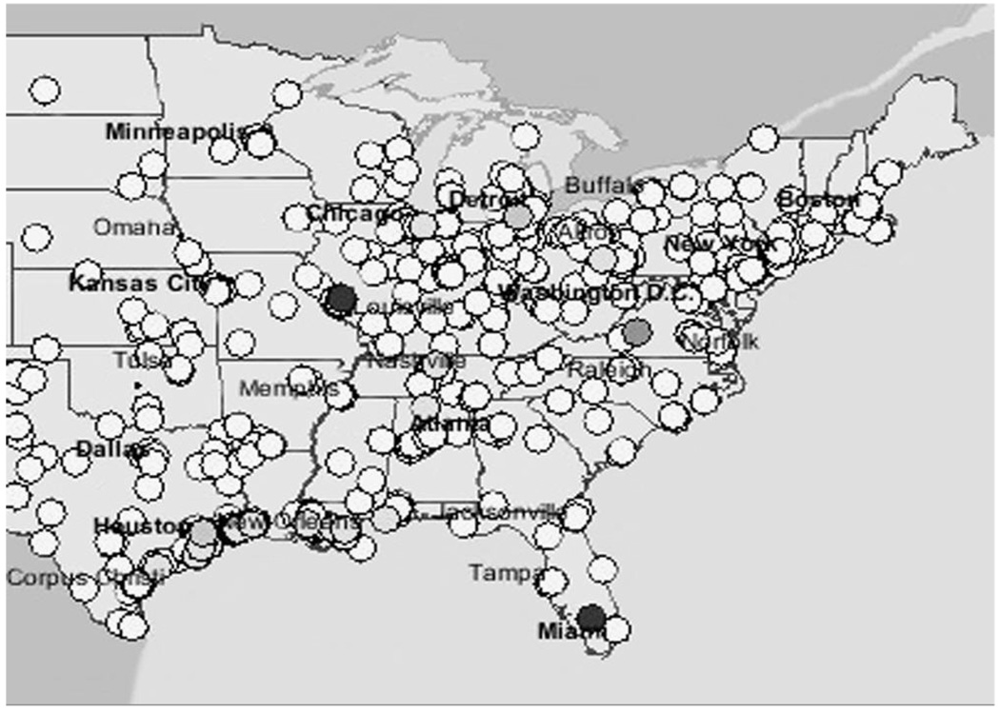

**Caption:** Map Showing High Chemical Release.

**What you're seeing:**
- A map with **very large or bright markers** indicating high chemical release at specific sites
- This figure was used specifically to **illustrate the risk of misinterpretation** — high release ≠ high health threat
- The article states: "a casual viewer…might infer that an area with a high release of a chemical always indicates a heightened threat to human health or the environment. However, many other factors must be considered in risk assessment"
- This is the primary source for our NF-08 requirement

**Design implications for clone:**
- Add a persistent, dismissible **interpretation banner** below the map: *"Release quantity does not directly indicate health risk. Toxicity, dispersal rates, and exposure pathways vary by chemical. See FAQ."*
- On the **demographic overlay** showing cancer mortality co-located with TRI sites, display: *"Correlation does not imply causation. These datasets are shown for research purposes."* (UCD 2011, mortality tab only)
- Include a dedicated **FAQ page/modal** answering: "What does release amount mean?", "Does a large release mean my neighborhood is unsafe?", "How do I interpret this data?"

---

## Part II: Redesigned TOXMAP — ArcGIS for Server / Flex Era (2013–2014)

### Fig 2015-1: The 2004 TOXMAP (archival reference in 2015 article)
> *Source: 2015 article, Figure 1 (same era as Part I above)*

*[View figure on PMC](https://pmc.ncbi.nlm.nih.gov/articles/PMC4251466/figure/F1/)*


**Caption:** TOXMAP facilities map, 2004.

*(See Fig 1-2006-A above — this is the same era, shown again in the 2015 article for before/after comparison.)*

---

### Fig 2015-2: Redesigned Welcome Window
> *Source: 2015 article, Figure 2*

*[View figure on PMC](https://pmc.ncbi.nlm.nih.gov/articles/PMC4251466/figure/F2/)*

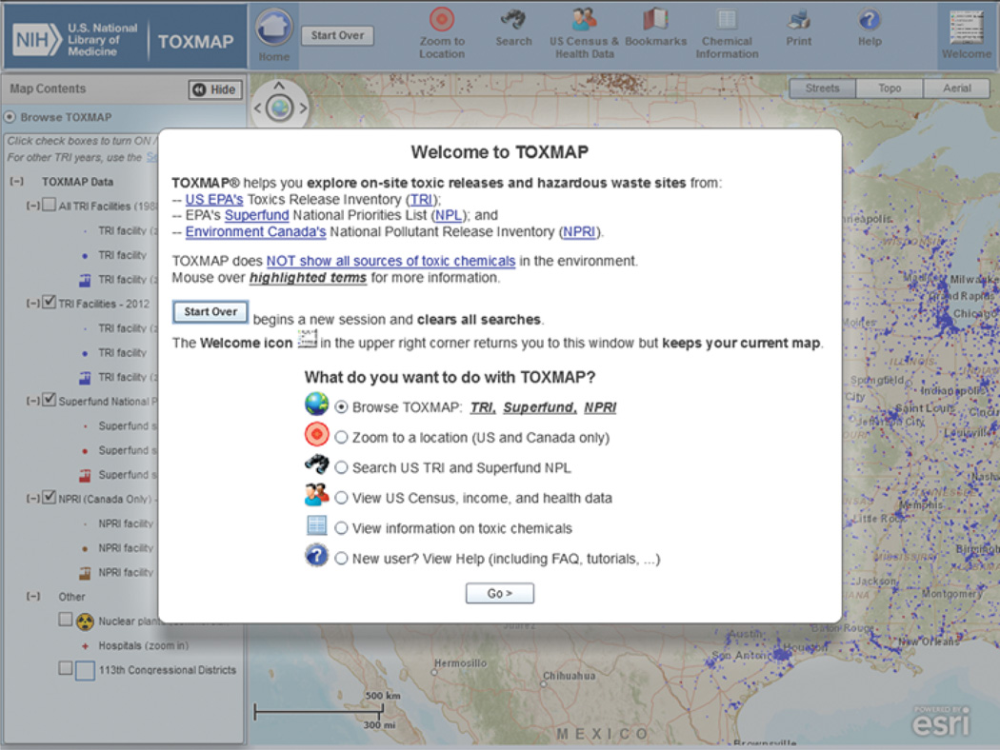

**Caption:** Welcome window for the new version of TOXMAP.

**What you're seeing:**
- The **redesigned welcome screen** (2013 version)
- A modal/overlay that appears before entering the full map
- Contains: description of TOXMAP, radio buttons for choosing entry mode (Browse / Search / Zoom to Location)
- The UCD 2011 study specifically flagged this welcome screen as being **skipped by users** who clicked "Enter Site" without reading
- Layout: centered modal, ~700×500px (larger than original), icons beside radio options

**Design implications for clone:**
- The welcome screen pattern should be reconsidered — UCD 2011 showed users skip it
- **Recommended for clone**: Replace welcome modal with a persistent **contextual tooltip tour** that overlays on first visit (e.g., React Joyride or Shepherd.js) — guides users through the map itself rather than a pre-map modal
- If a welcome screen is kept: no default radio button selected (forces engagement), larger whitespace, bold keywords
- Store "has seen onboarding" in `localStorage` — don't show again after first visit

---

### Fig 2015-3: Browse Mode — Map + Facility Detail
> *Source: 2015 article, Figure 3*

*[View figure on PMC](https://pmc.ncbi.nlm.nih.gov/articles/PMC4251466/figure/F3/)*

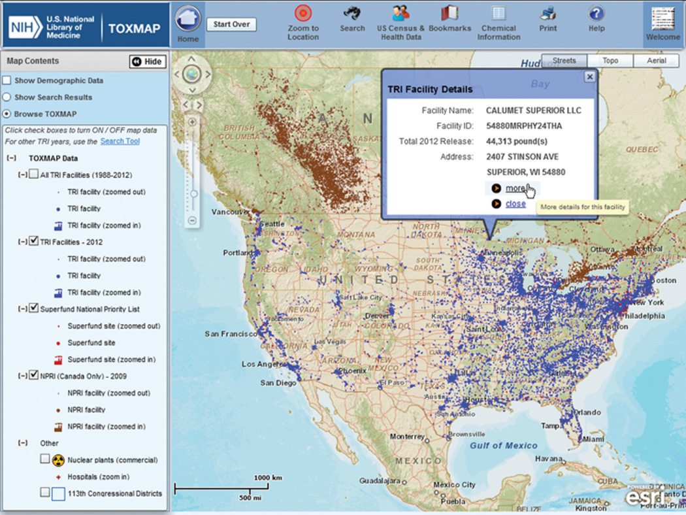

**Caption:** Browse TOXMAP Data and get facility details.

**What you're seeing:**
- The **redesigned Browse mode** — seamless panning map (no click-arrows) thanks to Flex/ArcGIS for Server
- Left sidebar showing **TOXMAP Data panel** — checkboxes to toggle TRI facility layers and Superfund layers
- A **facility detail popup** open showing chemical releases with bar charts
- The map basemap is noticeably more realistic (street names, shaded relief) vs. the 2004 flat USGS map
- The top toolbar has both text menus AND icon buttons (the redundancy UCD 2011 flagged)
- Side panel can be collapsed via the double-arrow icon (UCD 2011 found this icon confusing)

**Design implications for clone:**
- The left sidebar structure shows the layer toggle panel: TRI Facilities (all years / latest year), Superfund NPL, CERCLIS
- The "latest year" label was added based on user feedback — confirm `(latest year)` appears in all year references (F-18)
- The facility detail popup here uses a floating window over the map — UCD 2011 showed this is problematic (close button goes off-screen)
- **Clone improvement**: use a bottom sheet / slide-out drawer instead of a floating popup
- The double-arrow collapse icon → **replace with chevron or minus/plus** per UCD 2011 §"Collapsing the Side Panels"

---

### Fig 2015-4: Search Panel — TRI + Superfund
> *Source: 2015 article, Figure 4*

*[View figure on PMC](https://pmc.ncbi.nlm.nih.gov/articles/PMC4251466/figure/F4/)*

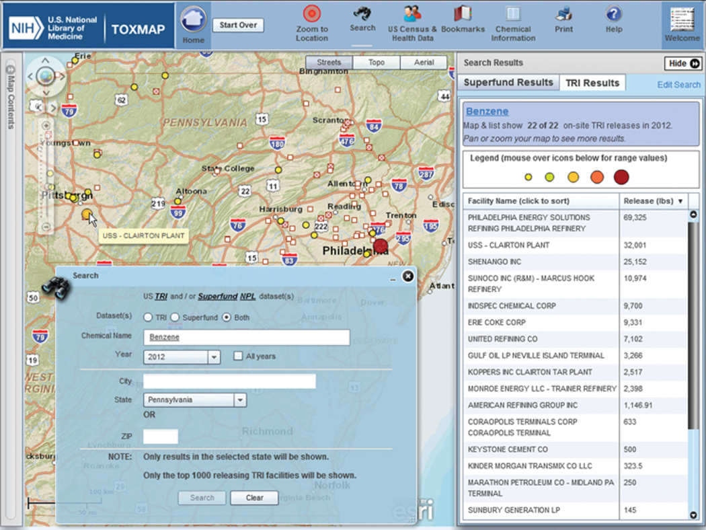

**Caption:** Search TRI releases and Superfund NPL sites.

**What you're seeing:**
- The **Search panel** (this is the "Quick Search" renamed, shown in sidebar)
- Chemical name input with auto-complete dropdown
- Location fields: address/city/state with dropdown menus
- TRI year selector dropdown
- **Two tabs at top: "TRI" and "Superfund"** — switching changes which dataset is searched
- The results table below shows facilities sorted by release amount
- On the right, a separate Search Results panel shows the map-linked data

**Design implications for clone — this is the most critical layout reference:**
- The two-tab TRI/Superfund structure shows the intended search scope selector
- In our **single sidebar** approach (F-08): the chemical input and location fields apply to both TRI and Superfund; use a radio or segmented control to switch dataset, not two full separate tabs
- The auto-complete is triggered on the chemical name field — this is the `GET /api/v1/chemicals/search?q=` endpoint
- Year selector: dropdown with years 1987–present plus "All years" option
- The right-side Search Results panel is exactly what UCD 2011 said must be eliminated in favor of a single panel

---

### Fig 2015-5: Census + Health Demographic Layers
> *Source: 2015 article, Figure 5*

*[View figure on PMC](https://pmc.ncbi.nlm.nih.gov/articles/PMC4251466/figure/F5/)*

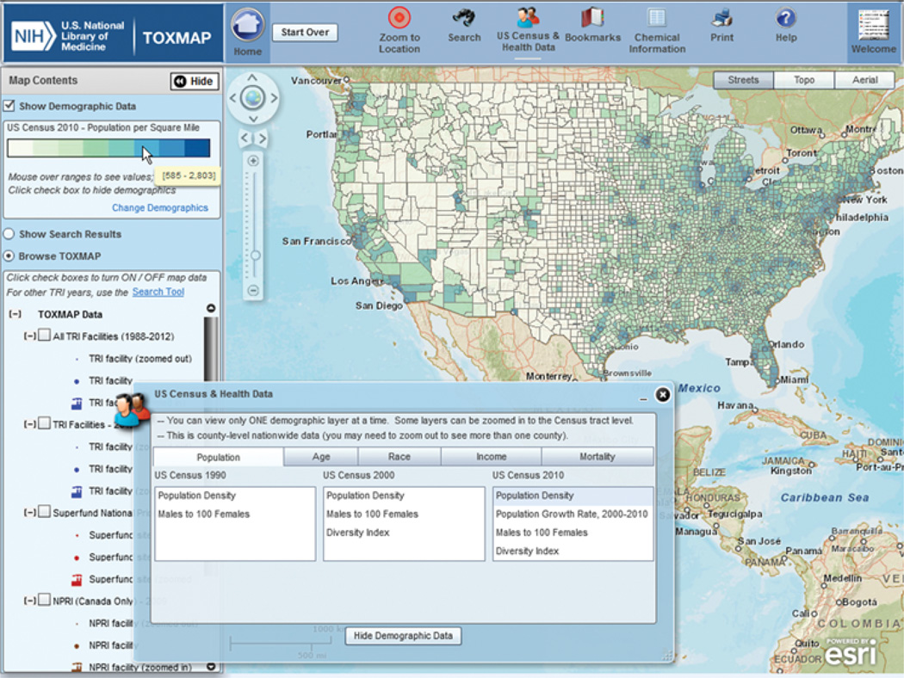

**Caption:** County- and census tract-level demographic layers.

**What you're seeing:**
- A **choropleth demographic layer** applied to the map — county polygons color-coded by a demographic variable
- The demographic panel/sidebar is open on the right showing the available layers organized into tabs:
  - **Census 2000 tab** and **Census 2010 tab** (two census periods)
  - Within each: Population, Income, Age, Race sub-categories
  - **Health/Mortality tabs**: Cancer Mortality (by gender), Heart Disease Mortality, etc.
- Color-coded legend is visible (the mouse-over issue UCD 2011 flagged)
- The map shows county-level shading across the visible region

**Design implications for clone:**
- Demographic panel organized as: **two year sections** (2000, 2020) × **two categories** (Census Data, Health/Mortality)
- Tabs within "Health/Mortality": Cancer, Heart Disease, Asthma (the planned future features from NLM)
- Within Cancer: Male, Female (no combined option — must explain why, per UCD 2011 §"Mortality Categories")
- Legend: show color blocks with inline range values AND units (%, $, people, years) — **never mouse-over only**
- The UCD 2011 zoom-out issue: when user is zoomed in closely, add a persistent note: *"Demographic data is at the county level. Zoom out to see more counties."*
- "Show Demographic Data" checkbox in the main sidebar left panel is the master toggle

---

### Fig 2015-6: TOXMAP Home Page — Version Selector
> *Source: 2015 article, Figure 6*

*[View figure on PMC](https://pmc.ncbi.nlm.nih.gov/articles/PMC4251466/figure/F6/)*

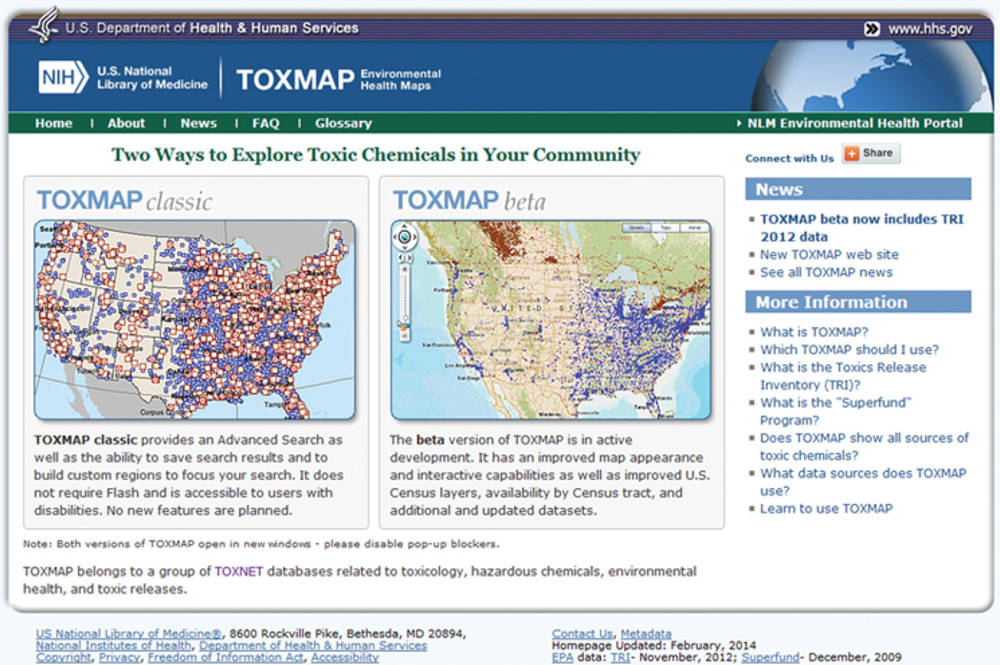

**Caption:** New TOXMAP home page, 2014.

**What you're seeing:**
- The **TOXMAP.nlm.nih.gov home page** for the 2013/2014 redesign
- Two links: "New TOXMAP" and "TOXMAP Classic" (maintaining backward compatibility)
- Contains: Glossary link, FAQ link, News section
- Clean, simple landing page that routes users to the appropriate version

**Design implications for clone:**
- The home page concept is important: provide a simple landing page at `/` with:
  - Brief description of what the application does (2–3 sentences)
  - "Launch Map" primary CTA
  - Links to: FAQ, Glossary, About/Data Sources, GitHub (for open-source project)
- No need for "classic" version toggle in the clone
- The FAQ and Glossary links should be persistent in the app header, not just on the landing page

---

## Part III: Design Evolution Summary

| Feature | 2004 (ArcIMS) | 2006–2012 (ArcIMS+) | 2013–2014 (Flex) | Clone Target |
|---------|--------------|---------------------|-----------------|--------------|
| Map interaction | Fixed, arrow-pan | Fixed, arrow-pan | Seamless drag-pan | Seamless (MapLibre GL) |
| Basemap | USGS flat | USGS flat | ArcGIS realistic | OpenStreetMap / Protomaps |
| TRI facilities | ✅ color-coded dots | ✅ + trend maps | ✅ + improved styling | ✅ MapLibre GL expressions |
| Superfund overlay | ❌ | ✅ diamond markers | ✅ | ✅ distinct diamond markers |
| Demographic overlay | ❌ | ✅ county polygons | ✅ + census tract | ✅ county + tract |
| Bar charts (3 tabs) | ✅ | ✅ | ✅ | ✅ Recharts |
| Chemical auto-complete | ❌ | Partial | ✅ | ✅ live search |
| Canadian NPRI | ❌ | ❌ | ✅ | ✅ optional layer |
| Nuclear plants | ❌ | ❌ | ✅ | ✅ optional layer |
| Census 2010 data | ❌ | Census 2000 only | ✅ 2000 + 2010 | ✅ 2000 + 2020 |
| Welcome screen | ❌ | ❌ | ✅ (UCD: skipped) | Replaced by onboarding tour |
| Dual side panels | Single (floating) | Single (floating) | ✅ dual (UCD: confusing) | **Single collapsible** |
| State filter behavior | Zooms only | Zooms only | Zooms only | **Zoom + optional restrict** |
| Empty table rows | N/A | N/A | ✅ (UCD: critical bug) | **Viewport-scoped only** |
| Export | ❌ | Partial | Partial | ✅ CSV + map image |
| TOXLINE/PubMed integration | ✅ | ✅ | ✅ | ✅ URL-based deep link |

---

## Marker Icon Design Reference

Based on Fig 9 (Superfund map) and Fig 1/5 (TRI maps):

| Site Type | Original Shape | Original Color | Clone Target |
|-----------|----------------|----------------|--------------|
| TRI Facility (small release) | Circle | Green | `#22c55e` circle |
| TRI Facility (medium release) | Circle | Yellow/Orange | `#f59e0b` circle |
| TRI Facility (large release) | Circle | Red | `#ef4444` circle |
| Superfund / NPL | Diamond | Red | `#ef4444` diamond (SVG) |
| Nuclear Plant | ☢ symbol | — | `#f97316` atom icon |
| Canadian NPRI | Circle | Purple | `#a855f7` circle |
| Hospital (optional) | H-cross | Blue | `#3b82f6` (distinct from red Superfund) |

> **⚠️ UCD 2011 §"Hospital Icons"**: Red cross for hospitals was confused with red Superfund diamonds. The clone must use **blue** for hospitals and reserve red exclusively for hazard markers.

---

## Chart Design Reference (from Fig 11)

The three-tab bar chart from Fig 11 maps to these Recharts components:

```tsx
// Tab 1: Top chemicals at facility (up to 5)
<BarChart data={topChemicals} layout="vertical">
  <XAxis type="number" unit=" lbs" />
  <YAxis type="category" dataKey="chemical_name" width={160} />
  <Bar dataKey="total_release_lbs" fill="#ef4444" />
  <Tooltip formatter={(v: number) => v.toLocaleString('en-US') + " lbs"} />
</BarChart>

// Tab 2: Release by medium (stacked)
<BarChart data={releasesByMedium} layout="vertical">
  <XAxis type="number" unit=" lbs" />
  <YAxis type="category" dataKey="chemical_name" width={160} />
  <Bar dataKey="air_release_lbs"          stackId="a" fill="#87CEEB" name="Air" />
  <Bar dataKey="water_release_lbs"        stackId="a" fill="#1E90FF" name="Water" />
  <Bar dataKey="land_release_lbs"         stackId="a" fill="#8B4513" name="Land" />
  <Bar dataKey="underground_release_lbs"  stackId="a" fill="#9370DB" name="Underground" />
  <Legend />
  <Tooltip formatter={(v: number) => v.toLocaleString('en-US') + " lbs"} />
</BarChart>

// Tab 3: 15-year trend
<BarChart data={trendData}>
  <XAxis dataKey="reporting_year" />
  <YAxis unit=" lbs" tickFormatter={(v: number) => v.toLocaleString('en-US')} />
  <Bar dataKey="total_release_lbs" fill="#f59e0b" />
  <Tooltip formatter={(v: number) => v.toLocaleString('en-US') + " lbs"} />
  <ReferenceLine y={0} stroke="#666" />
</BarChart>
```

