# TOXMAP UCD 2011 Usability Study — Figure Catalog

**Date:** 2026-07-30  
**Purpose:** Visual reference documenting all figures from the 2011 UCD usability evaluation. Maps findings to design implications for the open-source ToxMap clone.  
**Source:** FR508_10-4004_NLM_11-03-11 (User-Centered Design, Inc., August 2011)  
**Related docs:** [Usability Study Full Text](toxmap-usability-2011.md) · [Screen Catalog](TOXMAP_SCREEN_CATALOG.md) · [ADR-001](../adr/ADR-001-fastapi-postgis-react.md)

---

## Overview

The 2011 UCD usability evaluation tested the redesigned TOXMAP interface with 15 participants (4 concerned citizens, 11 professionals). Key findings shaped the final 2013 release and inform our clone's design decisions.

**Critical findings addressed:**
- Welcome screen skipped by users → Replace with contextual onboarding tour
- Two-panel layout confusing → Single collapsible sidebar
- "Quick Search" label unclear → "Search Chemical Releases by Location"
- "Demographics" label unclear → "US Census & Health Data"
- State selection zooms only → Add `restrict_to_state` filter option
- Mouse-over legend values → Display values inline

---

## Figure Catalog

### Fig 1: Welcome Screen
> *Source: UCD 2011, Figure 1*

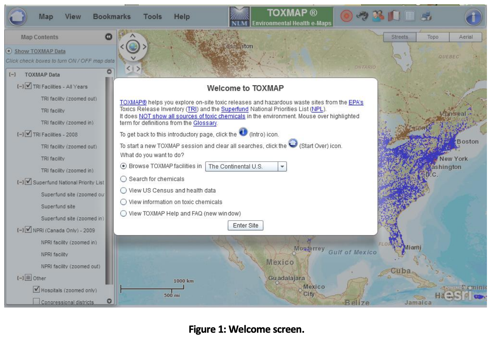

**Caption:** Welcome screen.

**What you're seeing:**
- The original TOXMAP welcome modal that greets users on site entry
- Modal header: "Welcome to TOXMAP" with NLM logo
- Brief description of TOXMAP as a GIS for exploring EPA TRI and Superfund data
- Three radio button options:
  - "Browse TOXMAP Facilities Continental U.S." (pre-selected default)
  - "Search TRI Chemical Releases and/or Superfund NPL Sites"
  - "Zoom map to City / State / Zip"
- Blue "Enter Site" button at bottom

**UCD 2011 finding:** Users skipped this screen entirely, going straight to "Enter Site" without reading. The dense text and default selection encouraged ignoring the content.

**Design implication for clone:**
- ❌ Don't replicate: Pre-selected default option
- ❌ Don't replicate: "Enter Site" as strong call-to-action that bypasses content
- ✅ Adopt: Replace welcome modal with contextual onboarding tour (Shepherd.js/React Joyride)

---

### Fig 2: Mockup of Alternative Welcome Screen
> *Source: UCD 2011, Figure 2*

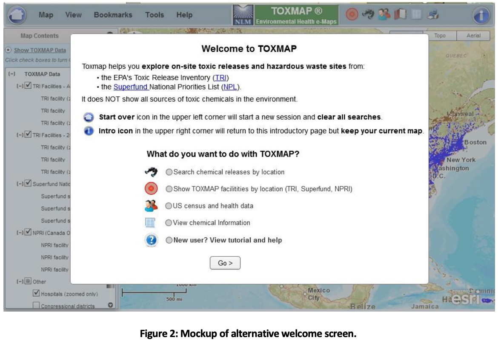

**Caption:** Mockup of alternative welcome screen.

**What you're seeing:**
- UCD's recommended redesign of the welcome modal (~700×500px, larger)
- Key improvements:
  - **Bold keywords** for scanning
  - **Bulleted** TRI and Superfund descriptions
  - **Icons beside each radio option** (matching toolbar icons)
  - **No default selection** — forces user engagement
  - "Enter Site" relabeled to "**Go >**" (less of a "skip" affordance)
  - New option: "**View tutorial and help**" (bold, differentiated from features)
  - "Start Over" and "Intro" icon explanations reformatted with aligned icons

**Design implication for clone:**
- ✅ Adopt: If using a welcome screen, require explicit selection (no default)
- ✅ Adopt: Bold keywords, bulleted descriptions
- ✅ Adopt: Icons beside options for visual association
- ✅ Adopt: Tutorial/help option prominently displayed

---

### Fig 3: State Menu within "Find Address"
> *Source: UCD 2011, Figure 3*

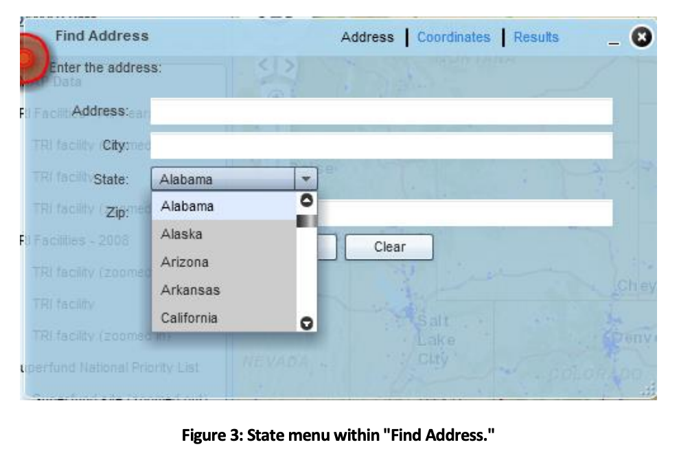

**Caption:** State menu within "Find Address."

**What you're seeing:**
- The "Find Address" dialog dropdown for state selection
- Dropdown contains alphabetical list of 50 US states (starting with Alabama)
- **No "Continental US" option** at the top

**UCD 2011 finding:** Inconsistent with Quick Search, which has "Continental US" as the first state option. Users expected the same options in both places.

**Design implication for clone:**
- ✅ Adopt: Standardize state selection across all interfaces
- ✅ Adopt: Always include "Continental US" / "All States" as first option

---

### Fig 4: State Menu within "Quick Search"
> *Source: UCD 2011, Figure 4*

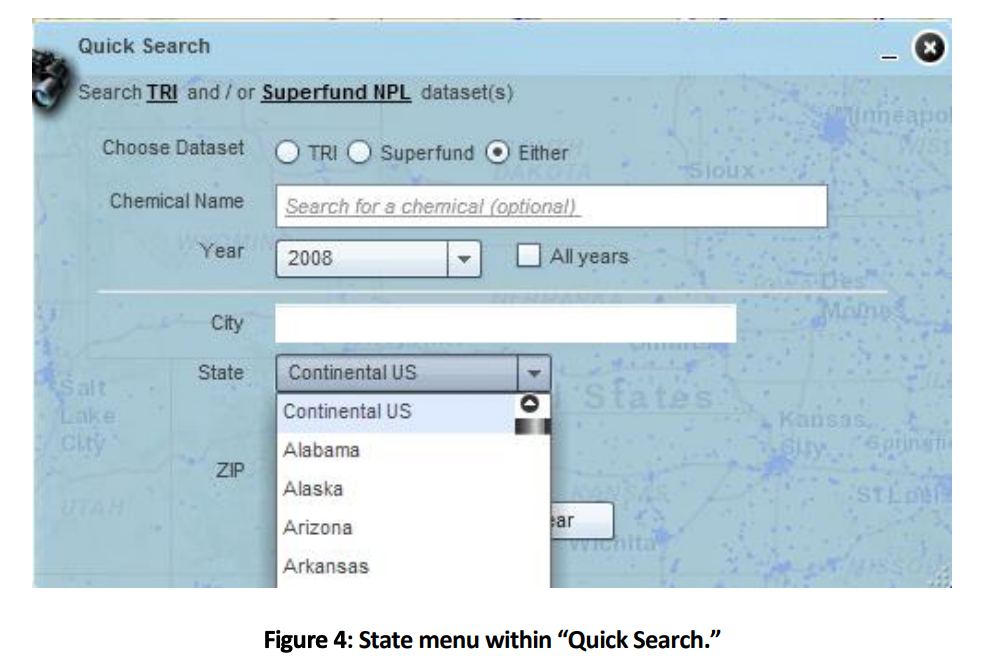

**Caption:** State menu within "Quick Search."

**What you're seeing:**
- The "Quick Search" dialog dropdown for state selection
- **"Continental US" appears as the first/default option** before the alphabetical state list

**Design implication for clone:**
- ✅ Adopt: This is the correct pattern — "All States" / "Continental US" first, then alphabetical states

---

### Fig 5: Menus and Icons (Highlighted) to Access Main Functionality
> *Source: UCD 2011, Figure 5*

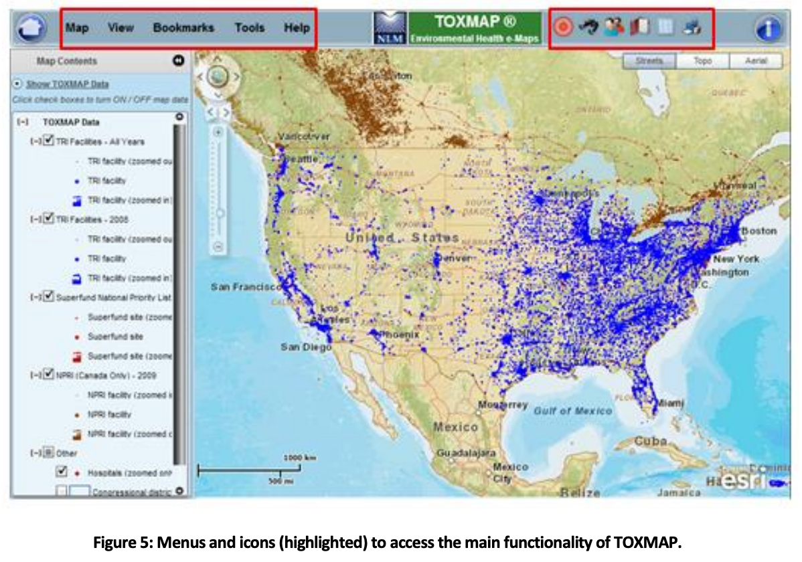

**Caption:** Menus and icons (highlighted) to access the main functionality of TOXMAP.

**What you're seeing:**
- The full TOXMAP interface with **red highlight boxes** around:
  - **Top-left text menus:** Map, View, Bookmarks, Tools, Help
  - **Top-right icons:** Find Location, Quick Search, Demographics, Bookmarks, Chemical Info, Print, Info
- The TOXMAP logo with "Environmental Health e-Maps" tagline
- Map of continental US with TRI facility dots
- "Map Contents" panel on left with layer checkboxes

**UCD 2011 finding:** Redundancy between text menus and icons confused users. First-time users preferred text menus (more explanatory); experienced users preferred icons (faster). The "Tools" menu duplicated all icon functionality.

**Design implication for clone:**
- ❌ Don't replicate: Redundant text menus + icon bars
- ✅ Adopt: Single toolbar with **labeled icons** (combines benefits of both)
- ✅ Adopt: Help menu can remain as dropdown if it contains multiple items

---

### Fig 6: Mockup of Labeled Icons
> *Source: UCD 2011, Figure 6*

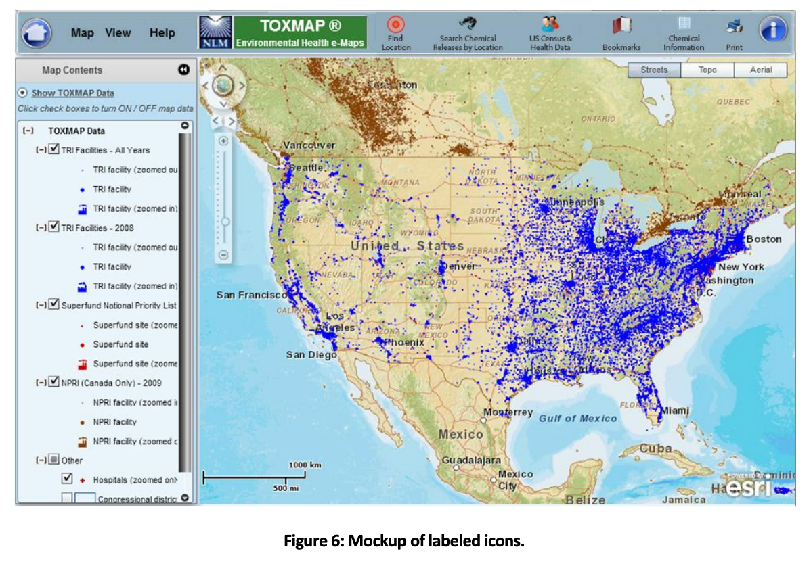

**Caption:** Mockup of labeled icons.

**What you're seeing:**
- UCD's recommended **labeled icon toolbar** design:
  - "Find Location" with magnifying glass icon
  - "Search Chemical Releases by Location" with binoculars icon
  - "US Census & Health Data" with people icon
  - "Bookmarks" with bookmark icon
  - "Chemical Information" with beaker icon
  - "Print" with printer icon
- Text menus removed (except Help, which requires dropdown)
- Map Contents panel visible on left

**Design implication for clone:**
- ✅ Adopt: Labeled icons as primary navigation pattern
- ✅ Adopt: "Quick Search" → "Search Chemical Releases" (more descriptive)
- ✅ Adopt: "Demographics" → "US Census & Health Data" (more descriptive)

---

### Fig 7: Browse TOXMAP Facilities in Continental US
> *Source: UCD 2011, Figure 7*

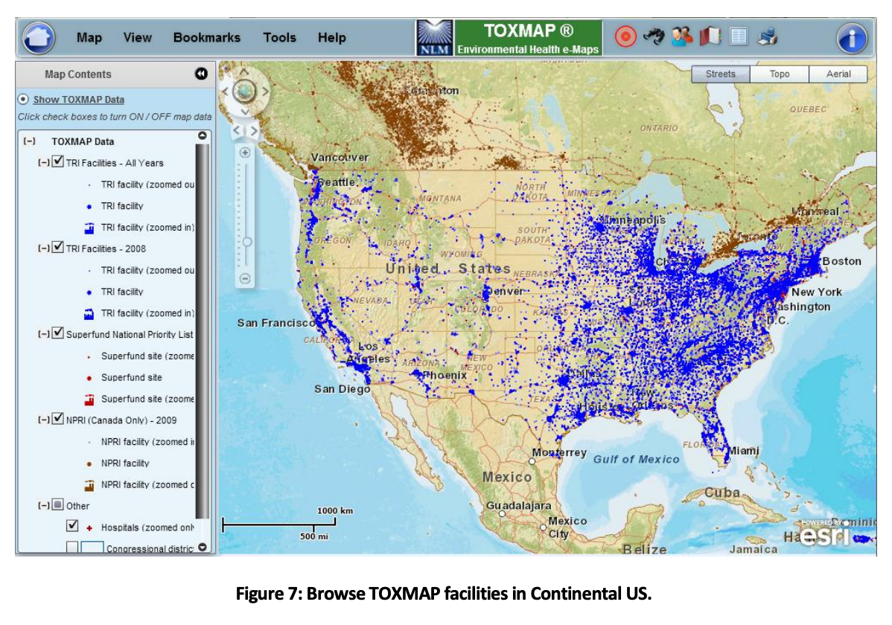

**Caption:** Browse TOXMAP facilities in Continental US.

**What you're seeing:**
- Default browse mode showing continental US map
- Left panel: "Show TOXMAP Data" radio button selected
- **TOXMAP Data tree** with expandable checkboxes:
  - TRI Facilities - All Years ✓
  - TRI Facilities - 2008 ✓
  - Superfund National Priority List ✓
  - NPRI (Canada Only) - 2009 ✓
  - Hospitals (zoomed only)
  - Congressional districts
- Blue TRI facility dots covering the map
- Basemap toggle buttons (Streets, Topo, Aerial) in top-right

**Design implication for clone:**
- ✅ Adopt: This is the default landing state after onboarding
- ✅ Adopt: Layer tree structure with checkboxes
- ✅ Adopt: Basemap selector (Streets, Topo, Aerial/Satellite)
- ✅ Adopt: Year-specific layer options ("2008" / "All Years")

---

### Fig 8: Panel with Radio Buttons for Both Quick Search and TOXMAP Data (Highlighted)
> *Source: UCD 2011, Figure 8*

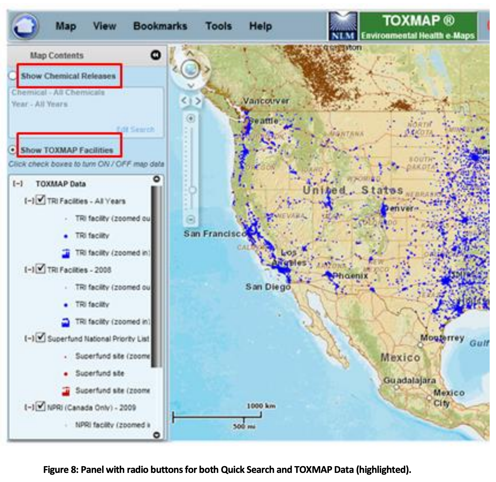

**Caption:** Panel with radio buttons for both Quick Search and TOXMAP Data (highlighted).

**What you're seeing:**
- Left panel with **red highlight boxes** around:
  - "Show Chemical Releases" radio button (renamed from "Show Quick Search")
  - "Show TOXMAP Facilities" radio button (renamed from "Show TOXMAP Data")
- TOXMAP Data tree with layer icons showing zoom-level variants:
  - TRI facility icons at zoomed out / normal / zoomed in
  - Superfund site icons (red diamonds) at different zoom levels
  - NPRI (Canada) icons (yellow)
- Legend showing icon appearance at different zoom levels

**Design implication for clone:**
- ✅ Adopt: Clear mode toggle (Search Results vs. Browse) via radio buttons or segmented control
- ✅ Adopt: Show icon appearance at different zoom levels in legend
- ✅ Adopt: TRI circles vs. Superfund diamonds distinction

---

### Fig 9: Quick Search Results Panel on Right
> *Source: UCD 2011, Figure 9*

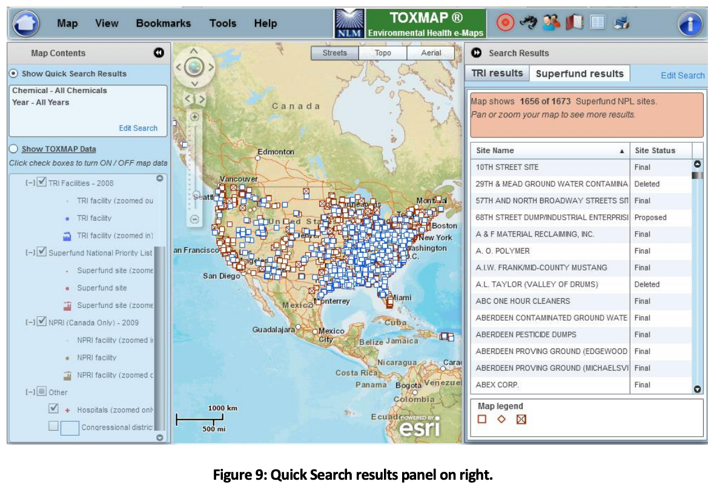

**Caption:** Quick Search results panel on right.

**What you're seeing:**
- The **two-panel layout** that UCD flagged as confusing:
  - **Left panel:** Map Contents with "Show Quick Search Results" selected, search criteria displayed
  - **Right panel:** Search Results with TRI/Superfund tabs
- Right panel shows "Superfund results" tab active with 1656 of 1673 NPL sites
- Table with Site Name and Site Status columns (Final, Deleted, Proposed)
- Map shows both TRI facilities (blue dots) and Superfund NPL sites (red/white diamonds)
- Combined legend at bottom

**UCD 2011 finding:** Users confused by simultaneous display of both panels. They tried to interact with both, not realizing they were mutually exclusive modes. Major usability issue.

**Design implication for clone:**
- ❌ Don't replicate: Two simultaneous side panels
- ✅ Adopt: Single collapsible sidebar (see Fig 10–11 mockups)

---

### Fig 10: Mockup of Combined Panel, Showing Search Results
> *Source: UCD 2011, Figure 10*

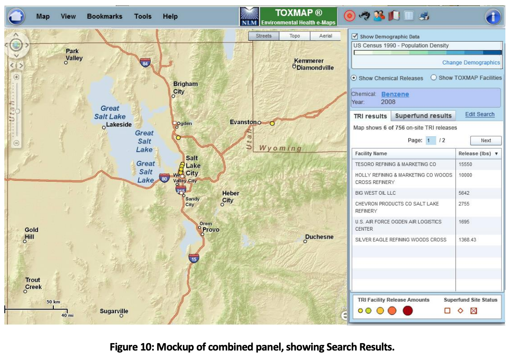

**Caption:** Mockup of combined panel, showing Search Results.

**What you're seeing:**
- UCD's recommended **single panel** design:
  - "Show Demographic Data" checkbox at top
  - Radio buttons: "Show Chemical Releases" (active) / "Show TOXMAP Facilities"
  - Search criteria: Chemical: Benzene, Year: 2008
  - **Two tabs:** "TRI results" / "Superfund results" with "Edit Search" link
  - Table: "Map shows 6 of 756 on-site TRI releases" with pagination
  - Facility names with Release (lbs) values
- **Combined legend** showing both TRI release colors (green→red circles) and Superfund status icons (square/diamond/X)
- Map shows Utah/Salt Lake area with colored facility markers

**Design implication for clone:**
- ✅ Adopt: This is the target sidebar layout
- ✅ Adopt: Single collapsible panel with mode toggle
- ✅ Adopt: Unified legend showing both TRI and Superfund symbols
- ✅ Adopt: Paginated results table with count ("Map shows X of Y")

---

### Fig 11: Mockup of Combined Panel, Showing TOXMAP Data
> *Source: UCD 2011, Figure 11*

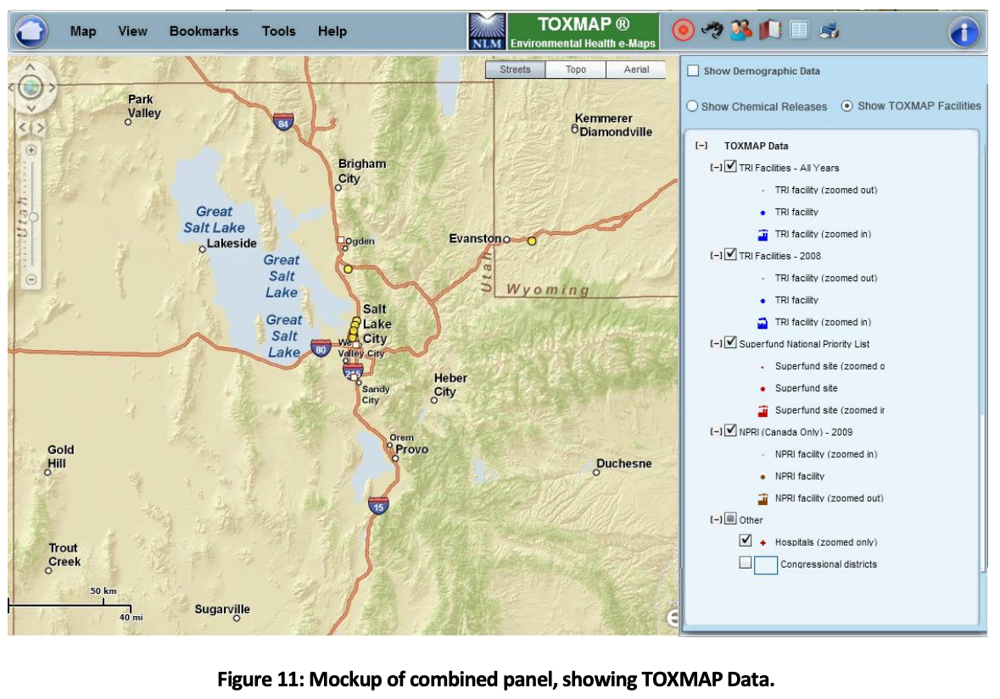

**Caption:** Mockup of combined panel, showing TOXMAP Data.

**What you're seeing:**
- Same single panel in Browse mode:
  - "Show Demographic Data" checkbox (unchecked)
  - "Show TOXMAP Facilities" radio button selected
  - TOXMAP Data tree with layer checkboxes and zoom-level icons
- No search criteria or results table visible
- Map shows Utah/Salt Lake area

**Design implication for clone:**
- ✅ Adopt: When switching to Browse mode, search results section collapses/hides
- ✅ Adopt: Layer tree remains visible in Browse mode

---

### Fig 12: TRI and Superfund Tabs (Highlighted) in Search Results
> *Source: UCD 2011, Figure 12*

**⚠️ Image file not extracted to repository.**

**Caption:** TRI and Superfund tabs (highlighted) in Search Results.

**What you're seeing (per study text):**
- Search Results panel with **two tabs**: "TRI results" and "Superfund results"
- When user searches for both TRI and Superfund sites, results appear in separate tabs
- Participants often did not notice the two tabs
- The map always displays both TRI and Superfund sites, but the table only shows results for one type at a time
- This causes confusion: no visible legend for some icons on the map

**UCD 2011 finding:** Users confused by separate tabs. When both datasets are selected, the legend should show both TRI and Superfund symbols together.

**Design implication for clone:**
- ✅ Adopt: Combined legend showing both TRI and Superfund symbols when viewing both datasets
- ✅ Adopt: Make tabs visually more prominent if using tabbed interface
- ✅ Adopt: Consider unified results view with type column instead of separate tabs

---

### Fig 13: Mockup of Search Results
> *Source: UCD 2011, Figure 13*

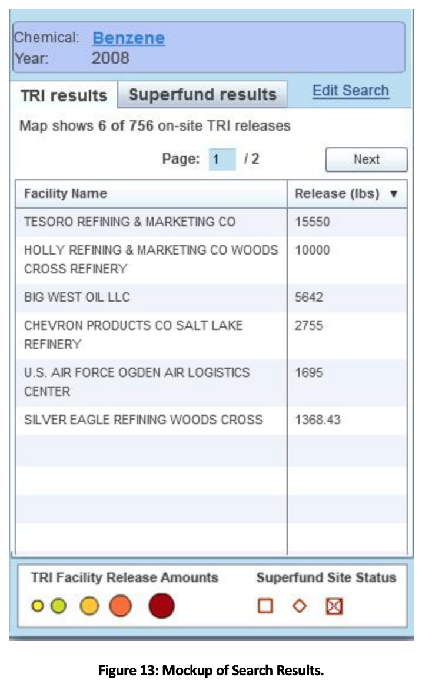

**Caption:** Mockup of Search Results.

**What you're seeing:**
- Detailed mockup of the Search Results panel component:
  - Header: "Chemical: Benzene" (blue link), "Year: 2008"
  - Tabs: "TRI results" (selected) / "Superfund results" + "Edit Search" link
  - Status: "Map shows 6 of 756 on-site TRI releases"
  - Pagination: "Page: 1 / 2" with "Next" button
  - **Sortable table** (▼ indicator on Release column):
    - TESORO REFINING: 15,550 lbs
    - HOLLY REFINING: 10,000 lbs
    - BIG WEST OIL: 5,642 lbs
    - etc.
- Combined TRI/Superfund legend at bottom

**Design implication for clone:**
- ✅ Adopt: Sortable table columns (sort indicator visible)
- ✅ Adopt: Pagination with page count
- ✅ Adopt: "Edit Search" link to modify criteria
- ✅ Adopt: "Map shows X of Y" viewport-aware count
- ✅ Adopt: Combined legend when showing both datasets

---

### Fig 14: Search Results When Nevada Was Specified as the State
> *Source: UCD 2011, Figure 14*

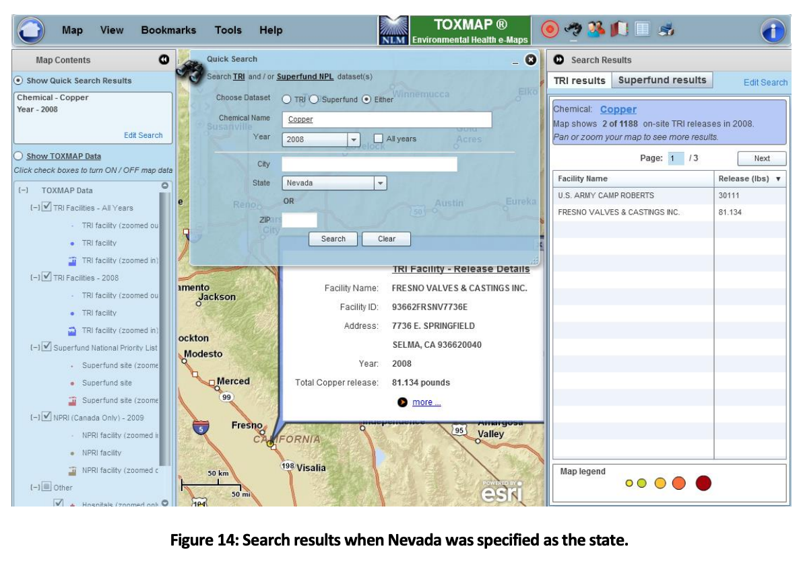

**Caption:** Search results when Nevada was specified as the state.

**What you're seeing:**
- **Critical usability issue illustration:**
  - Quick Search dialog open with State: "Nevada" selected, Chemical: "Copper", Year: 2008
  - Map shows California/Nevada border area
  - Search Results show facilities **from California** (FRESNO VALVES & CASTINGS INC) even though Nevada was selected
  - TRI Facility popup showing California facility details
- Users expected state selection to **filter** results; it only **zoomed** to the state boundary

**UCD 2011 finding:** This was a major source of confusion. Users expected state selection to limit results, not just center the map.

**Design implication for clone:**
- ❌ Don't replicate: Zoom-only state selection
- ✅ Adopt: Implement `restrict_to_state` parameter that actually filters results
- ✅ Adopt: Add checkbox "Restrict results to this state" for explicit behavior
- ✅ Adopt: Label location fields as "Zoom map to:" if zoom-only behavior is kept

---

### Fig 15: Inaccessible Close Button (Highlighted) on a Facility Pop-Up Box
> *Source: UCD 2011, Figure 15*

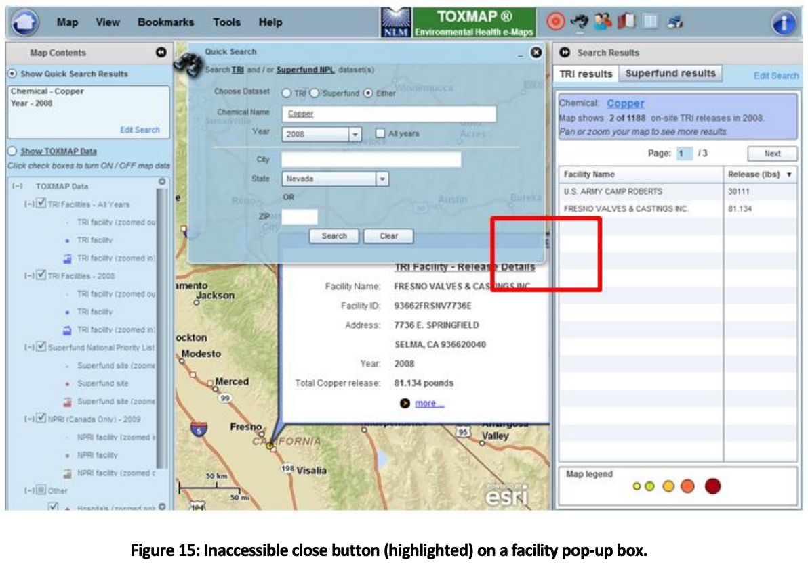

**Caption:** Inaccessible close button (highlighted) on a facility pop-up box.

**What you're seeing:**
- Same view as Figure 14 with **red highlight box** in top-right corner of facility popup
- The close button (X) is cut off or positioned off-screen
- Users couldn't close the popup without clicking elsewhere or using keyboard shortcuts

**UCD 2011 finding:** Facility popups often opened in positions where the close button was inaccessible. Users tried clicking outside, dragging, or clicking another facility.

**Design implication for clone:**
- ❌ Don't replicate: Floating popups that can position close button off-screen
- ✅ Adopt: Add "Close" link at bottom of popup as alternative dismissal
- ✅ Adopt: Use bottom-sheet or slide-out drawer instead of floating popups
- ✅ Adopt: Ensure close affordance is always accessible

---

### Fig 16: Demographics Box
> *Source: UCD 2011, Figure 16*

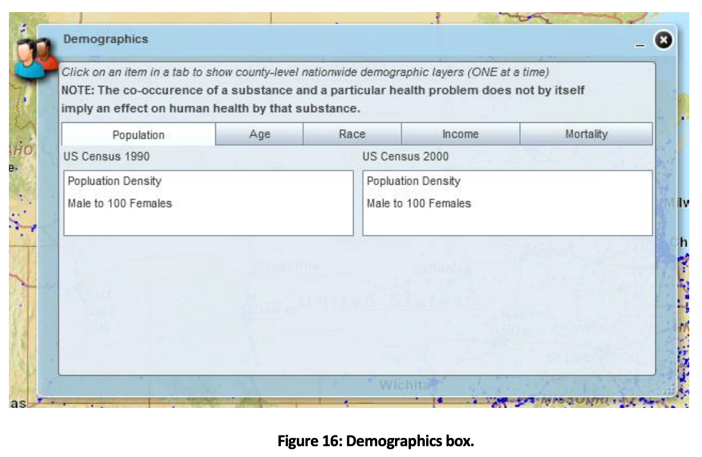

**Caption:** Demographics box.

**What you're seeing:**
- Demographics dialog with:
  - Italicized instructions about county-level data and one-layer-at-a-time restriction
  - **NOTE** about co-occurrence not implying causation (shown on ALL tabs, not just Mortality)
  - **Five tabs:** Population (active), Age, Race, Income, Mortality
  - Two census columns: US Census 1990 / US Census 2000
  - Population Density and Male to 100 Females options

**UCD 2011 findings:**
1. Instructions hard to read (italicized, dense paragraph)
2. NOTE about co-occurrence shown on ALL tabs when it only applies to Mortality
3. Users didn't realize only one layer can be active at a time

**Design implication for clone:**
- ❌ Don't replicate: Italicized instructions
- ❌ Don't replicate: Co-occurrence warning on non-mortality tabs
- ✅ Adopt: Bulleted, scannable instructions
- ✅ Adopt: Scope warnings to relevant tabs only

---

### Fig 17: Demographic Layer Can Be Only One Color When User Is Zoomed In
> *Source: UCD 2011, Figure 17*

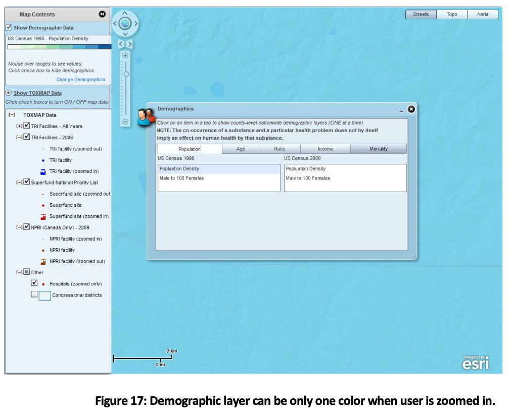

**Caption:** Demographic layer can be only one color when user is zoomed in.

**What you're seeing:**
- Map showing **solid light blue across entire visible area**
- Scale bar indicates "2 km / 1 mi" — very close zoom level
- Left panel shows "US Census 1990 - Population Density" with gradient legend
- Demographics dialog floating

**UCD 2011 finding:** Users zoomed in closely saw only one color and didn't understand why the layer wasn't showing variation. They needed prompting to zoom out.

**Design implication for clone:**
- ✅ Adopt: Add persistent hint when zoomed in: "Demographic data is at the county level. Zoom out to see more counties."
- ✅ Adopt: Consider census tract data for finer granularity at close zoom

---

### Fig 18: Mockup of Demographics Instructions
> *Source: UCD 2011, Figure 18*

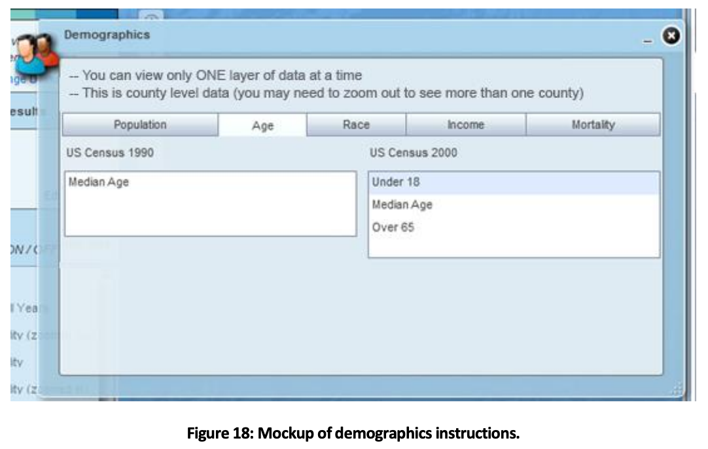

**Caption:** Mockup of demographics instructions.

**What you're seeing:**
- UCD's recommended Demographics dialog redesign:
  - **Bulleted instructions** (not italicized):
    - "-- You can view only ONE layer of data at a time"
    - "-- This is county level data (you may need to zoom out to see more than one county)"
  - Age tab active showing Median Age, Under 18, Over 65 options
  - **No co-occurrence NOTE** on Age tab (only on Mortality)

**Design implication for clone:**
- ✅ Adopt: Bulleted instruction format
- ✅ Adopt: Explicit zoom guidance
- ✅ Adopt: Tab-scoped warnings

---

### Fig 19: Mockup of Mortality Tab
> *Source: UCD 2011, Figure 19*

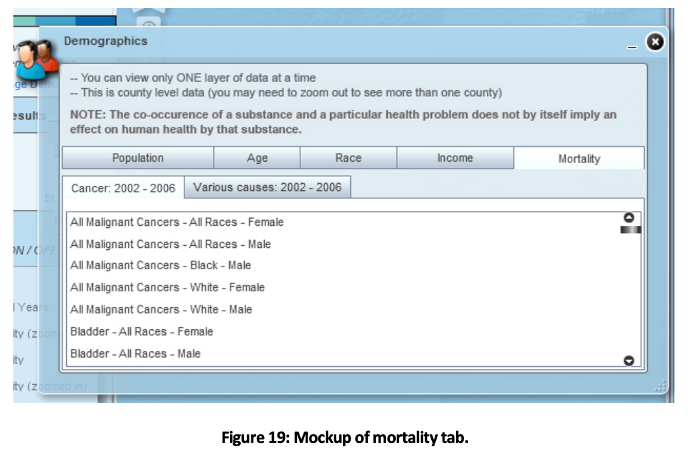

**Caption:** Mockup of mortality tab.

**What you're seeing:**
- Mortality tab with co-occurrence NOTE displayed (correctly scoped to this tab only)
- Sub-tabs: "Cancer: 2002 - 2006" (active) / "Various causes: 2002 - 2006"
- Scrollable list of cancer mortality options by gender/race:
  - All Malignant Cancers - All Races - Female
  - All Malignant Cancers - All Races - Male
  - All Malignant Cancers - Black - Male
  - etc.

**UCD 2011 finding:** Users wanted combined male/female cancer data but it wasn't available due to CDC data structure.

**Design implication for clone:**
- ✅ Adopt: Add explanation link for why gender-separated data is required
- ✅ Adopt: Display co-occurrence warning only on Mortality tab

---

### Fig 20: Mortality Options within Demographics
> *Source: UCD 2011, Figure 20*

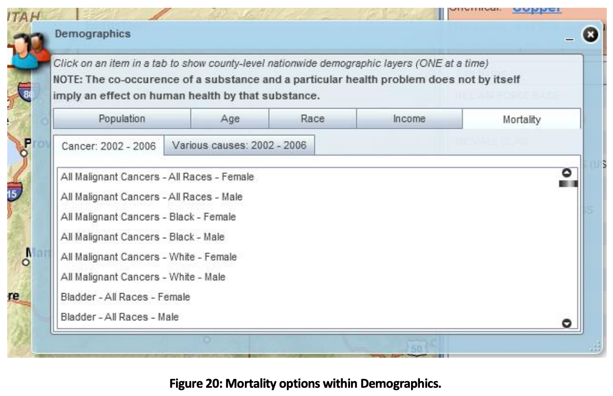

**Caption:** Mortality options within Demographics.

**What you're seeing:**
- Actual TOXMAP Mortality tab (not mockup) showing the same gender-separated mortality list
- Map visible in background showing Utah area

**Design implication for clone:**
- ✅ Adopt: Gender/race breakdown structure for mortality data
- ✅ Adopt: Scrollable list for numerous options

---

### Fig 21: Demographics Legend
> *Source: UCD 2011, Figure 21*

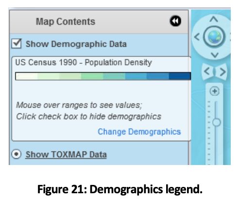

**Caption:** Demographics legend.

**What you're seeing:**
- Map Contents panel showing demographic legend:
  - "Show Demographic Data" checkbox (checked)
  - "US Census 1990 - Population Density" label
  - **Horizontal gradient bar** (white→dark blue)
  - Italicized: "Mouse over ranges to see values; Click check box to hide demographics"
  - "Change Demographics" link

**UCD 2011 finding:** Users either didn't notice the mouse-over instruction or thought it meant to mouse over the map. Mouse-over requires memory or repeated action.

**Design implication for clone:**
- ❌ Don't replicate: Mouse-over only for legend values
- ✅ Adopt: Display values inline with color blocks
- ✅ Adopt: Vertical legend layout with color on left, range on right

---

### Fig 22: Examples of Legend Values
> *Source: UCD 2011, Figure 22*

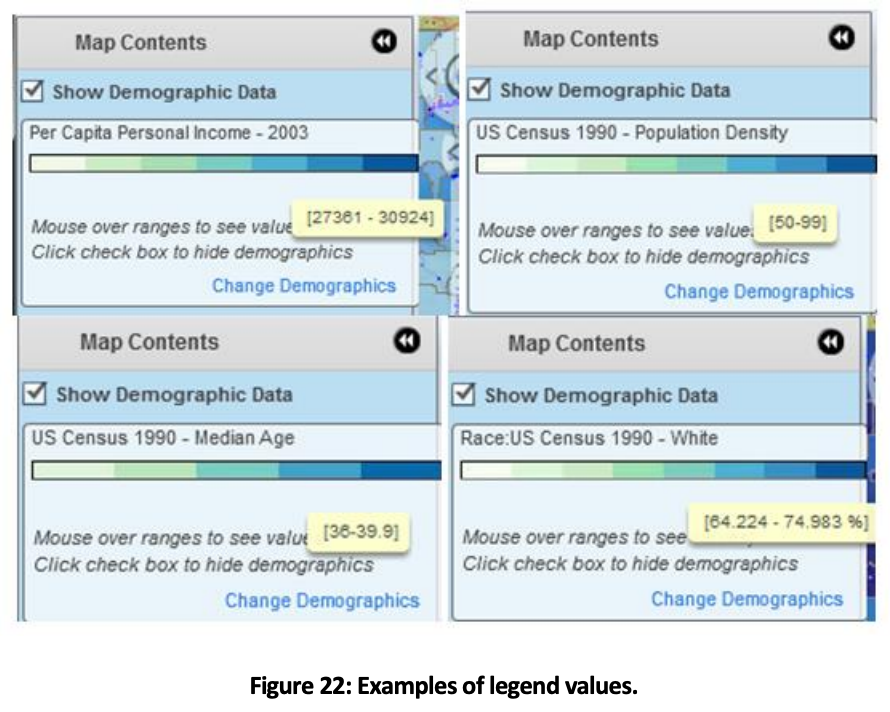

**Caption:** Examples of legend values.

**What you're seeing:**
- **Four examples** of demographic legend tooltips showing inconsistent unit labeling:
  - Per Capita Personal Income: "[27361 - 30924]" — **no $ sign**
  - Population Density: "[50-99]" — **no "per sq mi"**
  - Median Age: "[36-39.9]" — **no "years"**
  - Race: White: "[64.224 - 74.983 %]" — **has %** (only one with units!)

**UCD 2011 finding:** Inconsistent unit labeling confused users. Only Race showed units.

**Design implication for clone:**
- ✅ Adopt: Always include scale units (%, $, years, people per sq mi)
- ✅ Adopt: Consistent formatting across all demographic types

---

### Fig 23: Chemical Information Box
> *Source: UCD 2011, Figure 23*

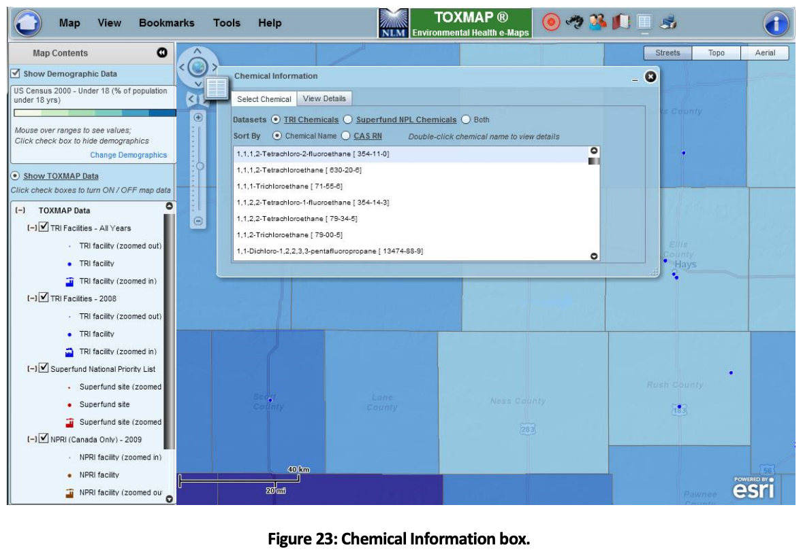

**Caption:** Chemical Information box.

**What you're seeing:**
- Chemical Information dialog:
  - Tabs: "Select Chemical" (active) / "View Details"
  - Dataset radio: TRI Chemicals / Superfund NPL Chemicals / Both
  - Sort By: Chemical Name / CAS RN
  - "Double-click chemical name to view details"
  - **Scrollable list** of chemicals with CAS numbers:
    - 1,1,1,2-Tetrachloro-2-fluoroethane [354-11-0]
    - etc.

**UCD 2011 finding:** Scroll list difficult to navigate (users accidentally scrolled past target chemicals multiple times). Short scroll box height exacerbated the problem.

**Design implication for clone:**
- ❌ Don't replicate: Scroll-only chemical list
- ✅ Adopt: Add type-ahead filter (like Quick Search has)

---

### Fig 24: Quick Search with Lookup Box for Chemical Name
> *Source: UCD 2011, Figure 24*

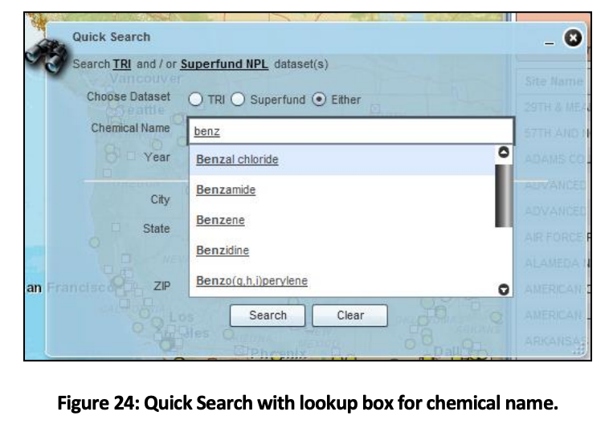

**Caption:** Quick Search with lookup box for chemical name.

**What you're seeing:**
- Quick Search dialog with **auto-complete dropdown** active:
  - User typed "benz"
  - Dropdown shows filtered matches:
    - Benzal chloride (highlighted)
    - Benzamide
    - Benzene
    - Benzidine
    - Benzo(g,h,i)perylene

**Design implication for clone:**
- ✅ Adopt: Chemical auto-complete with `GET /api/v1/chemicals/search?q=` endpoint
- ✅ Adopt: Apply this pattern to Chemical Information panel as well (not just Quick Search)

---

## Missing Figures

The following figures are referenced in the usability study text but their image files were not extracted to the `figs/2011/` folder:

| Figure | Caption | Study Section |
|--------|---------|---------------|
| Fig 12 | TRI and Superfund tabs (highlighted) in Search Results | §Search: TRI and Superfund Tabs |
| Fig 25 | Icon (highlighted) for minimized Quick Search box | §Miscellaneous: Opening Minimized Icon Boxes |
| Fig 26 | Double arrow icon (highlighted) that collapses the side panel | §Miscellaneous: Collapsing the Side Panels |
| Fig 27 | Facility pop-up box title (highlighted) | §Miscellaneous: Underlining the Title on the TRI Facility Box |
| Fig 28 | TRI Facilities label for only the most recent data (highlighted) in TOXMAP Data panel | §Miscellaneous: Why 2008 Data? |

---

## Summary: Design Rules Derived from UCD 2011

| Rule ID | Finding | Clone Implementation |
|---------|---------|---------------------|
| UCD-01 | Users skip welcome screens | Replace with contextual onboarding tour |
| UCD-02 | Two-panel layout confuses users | Single collapsible sidebar |
| UCD-03 | "Quick Search" label unclear | "Search Chemical Releases by Location" |
| UCD-04 | "Demographics" label unclear | "US Census & Health Data" |
| UCD-05 | State selection zooms but doesn't filter | Add `restrict_to_state` checkbox |
| UCD-06 | Mouse-over legend values ignored | Display values inline |
| UCD-07 | Floating popups have inaccessible close | Use drawer/bottom-sheet |
| UCD-08 | Chemical scroll list hard to navigate | Add type-ahead filter |
| UCD-09 | Redundant menus + icons confuse | Single labeled icon toolbar |
| UCD-10 | County data unclear when zoomed in | Add zoom-out hint |
| UCD-11 | Co-occurrence warning shown everywhere | Scope to Mortality tab only |
| UCD-12 | Legend units inconsistent | Always show units (%, $, years) |
| UCD-13 | Numbers hard to read without commas | Format all numbers with commas |
| UCD-14 | Year labels missing "(latest year)" | Add "(latest year)" to most recent |
| UCD-15 | Double-arrow collapse icon misunderstood | Use chevron or ±/−/+ |
| UCD-16 | TRI/Superfund tabs not noticed | Combined legend when viewing both; make tabs prominent |
| UCD-17 | NPL status requires 3 distinct symbols | Square (Final), Diamond (Proposed), X-Square (Deleted) |

---

## Defects Identified During Audit

### DEF-001: Superfund Status Symbols Missing 3-Way Distinction

**Source:** Cross-reference of UCD 2011 Fig 10 (combined legend mockup) with 2006 Screen Catalog Fig 9 (Virginia Superfund map)

**Original TOXMAP design:**
| NPL Status | Symbol | Shape |
|------------|--------|-------|
| Final (on NPL) | □ | Filled red square |
| Proposed | ◇ | Red diamond outline |
| Deleted | ⊠ | Square with X through it |

**Current clone implementation (FIXED 2026-07-30):**
| DB Status | Symbol | Shape |
|-----------|--------|-------|
| `NPL` | ■ | Filled red square |
| `Proposed` | ◇ | Red diamond outline |
| `Deleted` | ⊠ | Gray square with X |

**Issues (resolved):**
1. ~~Shape mismatch: All statuses use diamonds; original uses squares for Final/Deleted~~
2. ~~Missing 3-way distinction: `Deleted` renders same as `CERCLIS`~~
3. ~~Missing X-crossed symbol: Deleted sites should show an X through the shape~~

**Fix:** Story 4.BUG.5 — Implemented 3 distinct SVG sprites matching original TOXMAP legend

---

## Cross-References

- **TOXMAP_SCREEN_CATALOG.md** — 2006/2015 PMC article figures (production screenshots)
- **ADR-001** — Architecture decisions addressing UCD findings
- **TOXMAP_API_CONTRACT.md** — `restrict_to_state` parameter specification
- **toxmap-usability-2011.md** — Full UCD study text
